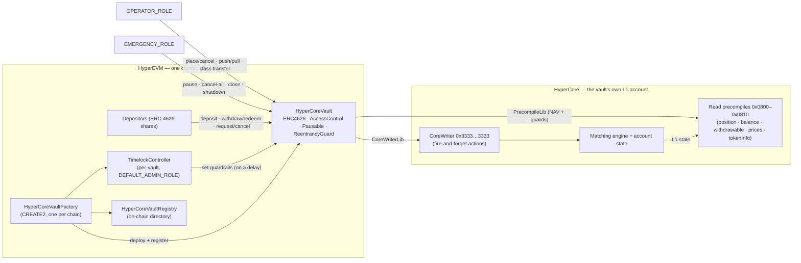
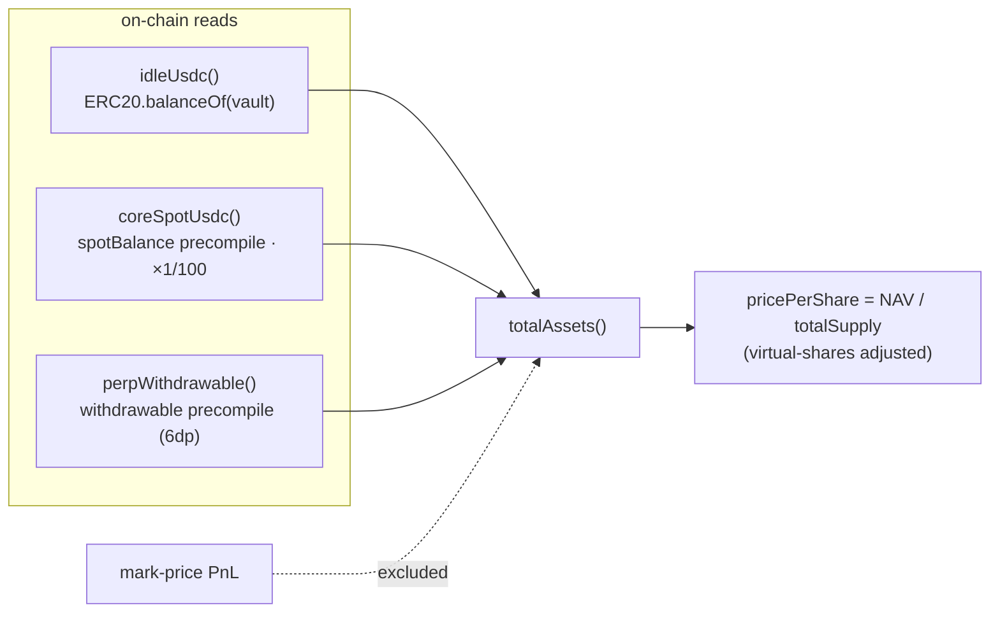
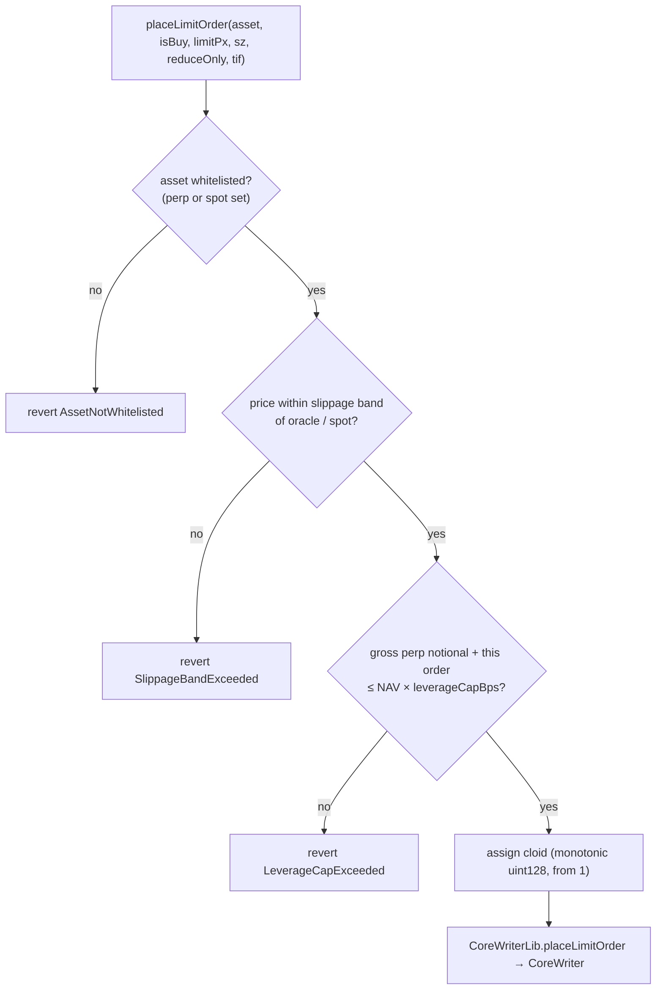
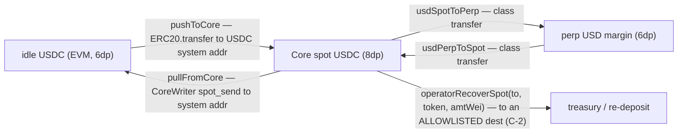

# HyperVault — Architecture

> **Status:** audited core (7 critical/high mitigations baked in) · trade path + redemption queue **proven on HyperEVM mainnet** · redemption hardening in progress · one P0 config blocker (Finding G).
> **As of:** 2026-06-03 · **Toolchain:** Solidity `0.8.27` (EVM `cancun`), OpenZeppelin Contracts v5, Foundry (optimizer 200, `bytecode_hash=none`) · Python live-runner. **Chain:** HyperEVM mainnet, chainId 999.
> This is the authoritative technical reference. For the leadership picture see [`ARCHITECTURE_EXECUTIVE.md`](ARCHITECTURE_EXECUTIVE.md); for the redemption review see [`REDEMPTION_ASSESSMENT.md`](REDEMPTION_ASSESSMENT.md); for the mainnet evidence see [`FORK_PROOFS.md`](FORK_PROOFS.md); for integration see [`INTEGRATION.md`](INTEGRATION.md).

---

## Table of contents

1. [What this is, and why](#1-what-this-is-and-why)
2. [System architecture](#2-system-architecture)
3. [Contract reference](#3-contract-reference)
4. [Share accounting — deposits, NAV, fees](#4-share-accounting--deposits-nav-fees)
5. [Redemption — synchronous 4626 + the request queue](#5-redemption--synchronous-4626--the-request-queue)
6. [Trading on HyperCore](#6-trading-on-hypercore)
7. [The Core⇄EVM money path & Finding G](#7-the-coreevm-money-path--finding-g)
8. [Roles, access control & guardrails](#8-roles-access-control--guardrails)
9. [Security model & audit mitigations](#9-security-model--audit-mitigations)
10. [Deployment & registry](#10-deployment--registry)
11. [Testing & proofs](#11-testing--proofs)
12. [Known limitations & roadmap](#12-known-limitations--roadmap)
13. [Repository map](#13-repository-map)

---

## 1. What this is, and why

`HyperVault` is an **EIP-4626 vault for HyperEVM** that runs a single Hyperliquid strategy from the
vault contract's *own* HyperCore L1 account. Depositors hold tokenized shares; a permissioned
**operator** trades the pooled USDC on perps and spot via the **CoreWriter** system contract; and
**NAV is computed trustlessly on-chain** from HyperCore read precompiles.

It replaces Hyperliquid's legacy **native vault** primitive, which is expensive and limited:

| | Legacy HL native vault | **HyperVault (HyperEVM)** |
|---|---|---|
| Creation cost | **10,000 USDC** | **Gas only** (~cents) |
| Markets | Perps only | Perps **+ spot + HIP-3** (any quote) |
| Operated by | An EOA | A smart contract (its own L1 account) |
| Share value | L1/operator-reported | **On-chain from precompiles** (excludes mark PnL) |
| Custody risk | Bounded by HL | Operator is **trade-only**; recovery is dest-allowlisted |
| Encoded rules | None | Whitelist · leverage cap · slippage band · fees · caps |
| Share token | Vault-internal | **ERC-4626 (12dp)** — composable |

**The trade-off** is deliberate and a net win for transparency: NAV must be derived from precompiles
(rather than trusted), and the strategy runs from a contract account (rather than an EOA). One vault =
one strategy; the contract *is* its own Core account, so there is no separate custodian.

**Current phase.** The trading + accounting core is audited and live-proven. The **redemption system**
is the active frontier: its end-to-end assessment (`REDEMPTION_ASSESSMENT.md`) is complete and was
closed on a **live funded spike** (2026-06-03, `FORK_PROOFS.md`). Remediation (Finding G + the keeper
loop + production key topology) is the next phase.

---

## 2. System architecture



**Trust model.** Three roles, ideally three different keys: `DEFAULT_ADMIN_ROLE` (a TimelockController)
governs the guardrails; `OPERATOR_ROLE` trades; `EMERGENCY_ROLE` halts. The operator can move money
between EVM ⇄ Core ⇄ perp margin and place orders, but **the only ways value leaves the vault** are
(a) LP redemptions and (b) `operatorRecoverSpot` to an **admin-allowlisted** destination (audit C-2).
Authenticity of *value* rests on HyperCore's precompiles, not on the operator.

**Why on-chain NAV is safe by construction.** `totalAssets()` reads HyperCore's own conservative
`withdrawable` for perp equity and the Core spot balance — never the operator's word, and never
mark-price PnL (which a thin market can be nudged to fake for a block). The operator's surface is
write-and-guarded; the depositor's surface (value, exit) is computed by the contract.

> **A forge fork cannot run the HyperCore precompiles.** Foundry's revm does not implement
> `0x0800–0x0810`, so on a fork the NAV reads return 0 and `totalAssets() == idleUsdc()`. This shapes
> the test strategy (§11): everything *not* requiring live Core state is fork-proven; states where
> `NAV > idle` (partial fills, the exit race) are proven on a **live funded spike**.

---

## 3. Contract reference

Three contracts in `src/`, plus five libraries in `src/libraries/`. solc `0.8.27`, EVM `cancun`, OZ v5.

| Contract (file) | Role | Key surface |
|---|---|---|
| **`HyperCoreVault`** (`HyperCoreVault.sol`) | The vault. `is IHyperCoreVault, ERC4626, AccessControl, Pausable, ReentrancyGuard` | deposit/withdraw/redeem, the request queue, trading, NAV, fees, guardrails (full surface below) |
| **`HyperCoreVaultFactory`** (`HyperCoreVaultFactory.sol`) | CREATE2 factory, one per chain. Deploys a **per-vault `TimelockController`** + the vault, registers it | `deployVault(cfg, timelockMinDelaySec)`, `vaultSalt`, `setStrictAssetValidation` |
| **`HyperCoreVaultRegistry`** (`HyperCoreVaultRegistry.sol`) | On-chain directory the frontend reads | `register` (factory/owner only), `getAllVaults`, `count`, `isRegistered` |
| `libraries/CoreWriterLib` | Typed CoreWriter actions (limit order, spot send, USD class transfer, cancels) | — |
| `libraries/PrecompileLib` | L1 read precompiles, lenient + `…Strict` variants | — |
| `libraries/AssetId` | Encode/decode perp (`index`) vs spot (`10_000 + index`) asset ids | — |
| `libraries/SystemAddress` | Per-token bridge/system address (`0x20 ‖ 11×0x00 ‖ tokenIndex`) | — |
| `libraries/Constants` | Compile-time addresses, action ids, TIF enum, decimals | — |

### 3.1 `HyperCoreVault` — constructor config

Deployed with one immutable `Config` struct (the factory sets `admin` to the per-vault timelock):

```solidity
struct Config {
    IERC20 asset;            // USDC ERC20 on HyperEVM (6dp)
    string name; string symbol;
    address admin;           // DEFAULT_ADMIN_ROLE — should be a TimelockController
    address operator;        // OPERATOR_ROLE
    address emergencyAdmin;  // EMERGENCY_ROLE
    address feeRecipient;    // immutable; receives mgmt-fee shares + perf fee in USDC
    uint16 leverageCapBps; uint16 slippageBandBps;
    uint16 mgmtFeeAnnualBps;  // hard cap 2_000 (20%/yr)
    uint16 perfFeeBps;        // hard cap 5_000 (50%)
    uint256 depositCap; uint256 maxDepositPerAddress;
}
```

The constructor reverts `ZeroAddress` on any zero role and `InvalidFeeConfig` if a fee exceeds its
hard cap. Share decimals are **12** (`_decimalsOffset() = 6` over 6-dp USDC — OZ virtual-shares
inflation defense).

### 3.2 `HyperCoreVault` — public surface, by group

| Group | Functions |
|---|---|
| **ERC-4626** | `deposit`, `mint`, `withdraw`, `redeem`, `asset`, `totalAssets`, `convertToShares/Assets`, `previewDeposit/Mint/Withdraw/Redeem`, `maxDeposit/Mint/Withdraw/Redeem`, `decimals`(=12), `pricePerShare`, `nav` |
| **Redemption queue** | `requestWithdraw(shares)`, `fulfillWithdraw(lp)` *(permissionless)*, `cancelWithdrawRequest()`, `pendingWithdrawalShares(lp)` |
| **NAV reads** | `idleUsdc`, `coreSpotUsdc`, `perpWithdrawable`, `strictNavReads` |
| **Operator — trade** | `placeLimitOrder(asset,isBuy,limitPx,sz,reduceOnly,tif)`, `cancelOrderByCloid(asset,cloid)`, `nextCloid` |
| **Operator — money** | `pushToCore(amt)`, `pullFromCore(amtWei)`, `usdSpotToPerp(ntl)`, `usdPerpToSpot(ntl)`, `operatorRecoverSpot(to,token,amtWei)`, `operatorSweepStranded(to)` |
| **Emergency** | `pause`, `unpause`, `emergencyCancelByCloid`, `emergencyCancelByOid`, `emergencyClosePositions`, `emergencyShutdown` *(one-way)* |
| **Admin / timelock** | `setWhitelistPerp/Spot`, `setLeverageCap`, `setSlippageBand`, `setSpotSlippageBand`, `setFees`, `setDepositCap`, `setMaxDepositPerAddress`, `setSpotRecoverDest`, `setStrictNavReads`, `sweep`, role grant/revoke |
| **Views** | `isPerp/SpotWhitelisted`, `whitelistedPerps/SpotsList`, `leverageCapBps`, `slippageBandBps`, `spotSlippageBandBps`, `mgmt/perfFeeBps`, `pendingMgmtFeeShares`, `feeRecipient`, `spotRecoverDest`, `emergencyShutdownActive` |

**Key events:** `Deposit`, `Withdraw`, `WithdrawalRequested`, `WithdrawalFulfilled`, `LimitOrderSubmitted`,
`OrderCancelByCloidSubmitted`, `BridgeDeposit`/`BridgeWithdraw`, `UsdClassTransferSubmitted`,
`OperatorSpotRecovered`, `MgmtFeeAccrued`, `PerfFeePaid`, `NavSnapshot`, `EmergencyShutdownTriggered`,
plus guardrail-update events. **Custom errors** include `WithdrawExceedsIdleBalance`, `AssetNotWhitelisted`,
`LeverageCapExceeded`, `SlippageBandExceeded`, `SpotRecoverDestinationNotAllowed`, `PrecompileRevert`/`PrecompileZero`
(strict reads), `DepositCapExceeded`, `PerAddressCapExceeded`, `EmergencyShutdownActive`.

### 3.3 `HyperCoreVaultFactory`

`deployVault(cfg, timelockMinDelaySec)`: deploys a `TimelockController(delay, [deployer], [deployer], deployer)`,
sets `cfg.admin = timelock`, then `CREATE2`-deploys the vault with **salt `keccak256(name, symbol, msg.sender)`**,
and registers it. Optional `strictAssetValidation` checks the configured asset against
`tokenInfo(USDC).evmContract` and reverts `AssetMismatch` — **off by default** (Finding H; would have
caught Finding G if on). The deployer is granted proposer/executor on the timelock and is *expected to
hand them to multisig/governance post-deploy*.

> **Note:** the testnet/mainnet deploy script (`script/Deploy.s.sol`) bypasses the factory's CREATE2
> path (EIP-170 init-code size) and deploys the timelock + vault directly, registering via the registry's
> owner-writer path. The factory remains the canonical production primitive.

### 3.4 `HyperCoreVaultRegistry`

A `VaultMetadata[]` directory (`vault, asset, operator, timelock, name, symbol, version, deployBlock`)
with `register` gated to **the factory or the registry owner**, `AlreadyRegistered` guard, and read
helpers (`getAllVaults`, `getVault`, `count`, `isRegistered`). The frontend enumerates vaults from
here — no off-chain indexer.

---

## 4. Share accounting — deposits, NAV, fees

### 4.1 NAV — "exitable equity"

```
totalAssets()  =  idleUsdc()        // ERC20 USDC balance on HyperEVM (6dp)
               +  coreSpotUsdc()    // Core spot USDC via precompile, normalized 8dp → 6dp
               +  perpWithdrawable()// HL's conservative redeemable perp equity (6dp)
```

Mark-price PnL is **intentionally excluded** — an operator can briefly mark a thin perp off-market and
inflate NAV for one block, so the vault uses HL's `withdrawable` (not `accountValue`). `strictNavReads`
(default **false**, audit H-1) switches the two Core reads from "return 0 on precompile failure" to
"revert on failure", and should be enabled once the vault's Core account is initialized.



### 4.2 Management fee — dilutive mint (capped 20%/yr)

Accrued on every state-changing call (`_accrueMgmtFee`), minted as fresh shares to `feeRecipient`:

```
feeAssets  = nav × mgmtFeeAnnualBps × dt / (BPS × SECONDS_PER_YEAR)
feeShares  = feeAssets × supply / (nav − feeAssets)      // clamped if feeAssets ≥ nav/2
```

Emits `MgmtFeeAccrued` + `NavSnapshot`. `pendingMgmtFeeShares()` previews the un-minted accrual for
frontends.

### 4.3 Performance fee — per-LP, paid in USDC, no dilution (audit C-3)

Each LP carries `_costBasisPerShare[lp]` (1e18-fixed price-per-share at entry), weighted-averaged on
later deposits and on share transfers. The fee is **crystallized in USDC out of the exiting LP's gross
payout** at `withdraw` / `redeem` / `fulfillWithdraw` — **not minted as shares**, so non-exiting
holders are never diluted:

```
gainPerShare = max(0, currentPricePerShare − costBasisPerShare[lp])
gainAssets   = gainPerShare × sharesRedeemed / WAD
perfFee      = gainAssets × perfFeeBps / BPS        // transferred in USDC to feeRecipient
```

Emits `PerfFeePaid(lp, amount)`. There is **no shared high-water mark** — each LP pays only on the gain
*they* realize at exit.

> **Cost-basis subtleties (audit mitigations).**
> - `requestWithdraw` snapshots the LP's cost basis into `costBasisAtRequest`, so `fulfillWithdraw`
>   charges the perf fee against the **request-time** basis, not a later one (case Q5).
> - A deposit made *while a request is open* includes the escrowed shares in the weighted-average so it
>   cannot reset cost basis to evade the perf fee (ultrareview `bug_010`).
> - `cancelWithdrawRequest` restores shares **and** preserves cost basis (case Q3).

---

## 5. Redemption — synchronous 4626 + the request queue

Redemption is a **synchronous ERC-4626 surface plus a bespoke, liquidity-gated escrow queue**. It is
**not** EIP-7540, and there are **no lockup / notice / gate / cooldown / epoch barriers** — only the
liquidity bound. Redeems are **never pausable**; `emergencyShutdown` (one-way) blocks *deposits* only.

### 5.1 Path A — synchronous, idle-bounded

`withdraw` / `redeem` are **capped to idle EVM USDC**: `maxWithdraw = min(owned, idle)`. `withdraw`
reverts `WithdrawExceedsIdleBalance` if `assets > idle`; `redeem` **partial-fills** — if
`previewRedeem(shares) > idle` it scales down to idle and burns only the corresponding shares. (A
naive 4626 router can therefore receive fewer assets than `previewRedeem` when capital is on Core —
documented for integrators.) `withdraw`'s `assets` argument is treated as **gross** so preview/max/allowance
invariants hold (ultrareview `merged_bug_002`).

### 5.2 Path B — the escrow queue (when capital is deployed)

```mermaid
sequenceDiagram
  autonumber
  actor LP as LP
  participant V as Vault
  participant K as Keeper (anyone)
  participant OP as Operator
  LP->>V: requestWithdraw(shares)
  V->>V: escrow shares at the vault; snapshot cost basis
  Note over OP: operator unwinds on Core & repatriates → idle refills
  K->>V: fulfillWithdraw(LP)
  alt idle covers the claim
    V->>LP: pay full claim (minus perf fee); burn shares
  else idle below the claim
    V->>LP: pay idle (partial); leave remainder escrowed
  end
  LP-->>V: cancelWithdrawRequest() (any time → shares back, cost basis preserved)
```

**Invariants:** one open request per LP; `requestWithdraw` reverts over-balance and no-ops on zero;
`fulfillWithdraw` is **permissionless** (keeper-friendly) and a clean no-op when there's no request or
no idle; the perf fee uses the request-time cost-basis snapshot. These (cases Q1–Q7) are fork-proven;
the `NAV > idle` cases (partial fill **Q4**, the direct-redeem-vs-queue race **F**) are **live-proven**
(§11).

### 5.3 The two paths, side by side

| | Path A — synchronous | Path B — request queue |
|---|---|---|
| Entry point | `withdraw` / `redeem` | `requestWithdraw` → `fulfillWithdraw` |
| Pays in full when | idle ≥ claim | operator repatriates → idle refills |
| Under-idle behaviour | `withdraw` reverts; `redeem` partial-fills | escrow; keeper partial-fills as idle refills |
| Who fulfils | the LP | **anyone** (permissionless) |
| Fairness | both paths draw the **same idle pool with no ordering** — a direct redeemer can drain idle ahead of a queued LP (Finding F; policy is P1) | — |

> **What's still to harden (P1).** A keeper service that watches `WithdrawalRequested` and repatriates;
> an on-chain `fulfillmentDeadline` + permissionless forced-close so the operator can't stall exits;
> and a documented fairness policy between the two paths.

---

## 6. Trading on HyperCore

The operator drives trading through `CoreWriterLib` (writes) and reads state via `PrecompileLib`.
**CoreWriter is fire-and-forget**: the EVM tx succeeds and events fire even if HyperCore later rejects
the action (place ≠ fill) — reconcile off-chain.

### 6.1 Order placement & guards



- **Whitelist** — perp/spot asset must be in the admin-managed set.
- **Slippage band** — perps compared to `oraclePx` (strict read, H-2/H-4), spots to `spotPx` via the
  per-asset `spotSlippageBandBps` (H-3); `0` opts out.
- **Leverage cap** — gross open perp notional (read at **strict** `markPx`, so a missing price fails the
  trade rather than silently dropping a position from the cap — H-2) plus the new order must stay under
  `NAV × leverageCapBps / BPS`. `reduceOnly` orders skip the cap. *(The position read used for the cap
  is deliberately lenient on zero positions — documented, ultrareview `bug_007`.)*
- **Cloid** — the vault assigns client order ids from a monotonic `uint128` (from 1; `0` = "no cloid"),
  so the operator can't collide ids and off-chain reconciliation is simple. `cancelOrderByCloid` is the
  normal cancel; `cancelOrderByOid` is EMERGENCY-only (for non-vault orders on the same Core address).

### 6.2 HyperCore encoding — get these exactly right

These have bitten repeatedly; they are inlined `Constants` (a wrong value needs a **redeploy**):

| Concern | Rule |
|---|---|
| **Action `px` & `sz` scale** | Both are `round(human × 10^8)` — a **uniform 10⁸ scale, NOT szDecimals-based**. Wrong scale → HyperCore reads sub-cent dust below the **$10 min notional** and silently drops the order. (This — not the TIF — was the root cause of the "HL won't take orders from a contract" saga; fixed in v1.3.) |
| **Read precompile prices** | `oraclePx` / `markPx` return `human × 10^(6 − szDecimals)`. **Normalize** before comparing to action-scale prices. |
| **TIF** | 1-indexed: `1=ALO, 2=GTC, 3=IOC` (no FOK). `tif=0` is invalid and silently dropped. |
| **Fire-and-forget** | EVM success ≠ HL acceptance. Reconcile via precompile reads off-chain. |
| **Asset id** | perp = `index`; spot = `10_000 + index` (`AssetId`). |

### 6.3 Read precompiles (`PrecompileLib`)

`0x0800–0x0810` cover position, spot balance, withdrawable, mark/oracle/spot price, perp/spot/token
info, account margin, and user-exists. Each has a **lenient** wrapper (returns a zero-struct on failure
— for optional metadata and fresh-vault tolerance) and a **`…Strict`** wrapper (reverts `PrecompileRevert`/
`PrecompileZero` — used for NAV-critical reads and trade guards under `strictNavReads`/the slippage band).

---

## 7. The Core⇄EVM money path & Finding G

The operator moves USDC across three locations: **idle (EVM)** → **Core spot** → **perp margin**.



The USDC bridge / system address is `0x2000…0000` (token index 0 in the last 8 bytes, big-endian;
`SystemAddress`).

> ### Finding G — the P0 blocker (confirmed live)
> On the **shipped configuration** the vault's `asset()` (`0xb883…630f`) is **not** the USDC that Core
> token 0 bridges to (`tokenInfo(0).evmContract = 0x6B9E…0A24`), and the bridge `0x2000…0000` is
> **blacklisted** on the shipped Circle USDC. Consequences, all now on-chain facts:
> 1. `pushToCore` / `pullFromCore` **revert** (`Blacklistable: account is blacklisted`) — the canonical
>    EVM↔Core bridge is unusable for this asset.
> 2. `coreSpotUsdc()` measures a token that is **not** `asset()` — that NAV term is unfaithful.
> 3. The linked USDC `0x6B9E…0A24` has bytecode but **reverts on every standard ERC-20 read**, so you
>    **cannot** simply redeploy with it (it can't back an ERC-4626).
>
> ⇒ The only realisation path is **Path B repatriation: `operatorRecoverSpot` → treasury → re-deposit**
> (proven live on 2026-06-03 — and note `operatorRecoverSpot` is fire-and-forget, so a keeper must
> reconcile Core state and retry). Fixing the asset linkage + wiring Path B is the **must-do before real
> LP money**. `operatorSweepStranded` recovers EVM `asset()` only when `totalSupply == 0` (the
> donate-to-empty-vault trap).

---

## 8. Roles, access control & guardrails

| Role | Holder (recommended) | Powers |
|---|---|---|
| `DEFAULT_ADMIN_ROLE` | **`TimelockController`** (24h+) | Whitelist (perp/spot), leverage cap, slippage bands, fees, deposit caps, `spotRecoverDest` allowlist, `strictNavReads`, `sweep` non-asset tokens, grant/revoke roles |
| `OPERATOR_ROLE` | Strategy hot key/bot | `placeLimitOrder`, `cancelOrderByCloid`, `pushToCore`/`pullFromCore`, `usdSpotToPerp`/`usdPerpToSpot`, `operatorRecoverSpot`, `operatorSweepStranded` |
| `EMERGENCY_ROLE` | Multisig (e.g. 2-of-3) | `pause`/`unpause`, `emergencyCancelByCloid`/`ByOid`, `emergencyClosePositions`, `emergencyShutdown` (one-way) |
| `feeRecipient` | Multisig | Receives mgmt-fee shares + perf fee in USDC; **immutable**, set at construction |

**Pause semantics (important):** the Core→EVM movers (`pullFromCore`, `usdSpotToPerp`/`usdPerpToSpot`,
`operatorRecoverSpot`) are `whenNotPaused`, so **pausing freezes the refill path** (Finding A) — while
**redemptions are never pausable**. `emergencyShutdown` blocks new deposits but leaves exits open.
`emergencyClosePositions` scales perp size from Core units to action units (ultrareview `bug_009`).

---

## 9. Security model & audit mitigations

**Trust posture.** A self-custodied managed account: value and custody are trust-minimized; trading
competence and operator/keeper liveness are assumed. Value authenticity = HyperCore precompiles.

**Audit mitigations baked in (v1.3):**

| ID | Mitigation | Where |
|---|---|---|
| **C-2** | `operatorRecoverSpot` destinations must be on an admin-managed `spotRecoverDest` allowlist — a compromised operator key cannot drain Core spot to an arbitrary address | `setSpotRecoverDest`, `operatorRecoverSpot` |
| **C-3** | Performance fee is paid **per-LP in USDC** from the exiting LP's payout — no fee-share mint, no dilution of stayers | `withdraw`/`redeem`/`fulfillWithdraw` |
| **H-1** | `strictNavReads` makes NAV precompile reads fail-closed (revert) instead of returning 0 | `coreSpotUsdc`/`perpWithdrawable` |
| **H-2** | Strict `markPx` in the leverage-notional sum — a missing mark fails the trade, not silently drops a position | `_grossOpenPerpNotional` |
| **H-3** | Per-spot `spotSlippageBandBps` — spot orders get a slippage band | `placeLimitOrder` (spot path) |
| ultrareview | `bug_010` (cost-basis escrow), `bug_009` (emergency-close size scale), `merged_bug_002` (gross `withdraw` assets), `bug_007` (documented lenient position read) | various |

**Redemption findings (assessment, proven on real bytecode — see `REDEMPTION_ASSESSMENT.md` / `FORK_PROOFS.md`):**

| ID | Finding | Severity | Status |
|---|---|:--:|---|
| **A** | Pause freezes the refill path; EMERGENCY_ROLE cannot repatriate | High | proven (fork) |
| **B** | No permissionless escape hatch if the operator goes dark (funds frozen, not stolen) | High | proven (fork) |
| **C** | Shipped config collapses operator/emergency/fee into one EOA + 0-delay timelock | High | proven (fork) |
| **D/E** | Keeper unbuilt; `fulfillWithdraw` decoupled from repatriation, no on-chain deadline | High/Med | partial / proven |
| **F** | No fairness between the two exit paths (direct redeem can jump the queue) | Med | **proven live** |
| **G** | Configured USDC ≠ Core-linked USDC; canonical bridge unusable | High | **proven live** (P0) |
| **H** | Safety defaults (`strictNavReads`, `strictAssetValidation`) ship **off** | Med | proven (fork) |
| **Q4** | Partial-fill math when claim > idle | — | **proven live** |

---

## 10. Deployment & registry

**Deploy.** `script/Deploy.s.sol` reads a JSON config (`deployments/configs/<name>.json`), deploys a
`TimelockController` + the vault, registers it, and (when `timelockMinDelaySec == 0`) seeds the asset
whitelist via the timelock. It writes an artifact to `deployments/<chain>/<name>.json` (`vault`, `asset`,
`timelock`, `registry`, …). The vault deploy is ~9M gas (> the 2M small-block limit) — **opt the deployer
into HyperEVM big blocks first** (`Exchange.use_big_blocks(True)`); toggle off afterwards so small txns
stay on fast blocks.

```json
// deployments/configs/<name>.json
{ "name": "...", "symbol": "...",
  "operator": "0x…", "emergencyAdmin": "0x…", "feeRecipient": "0x…",
  "usdcAddress": "0x…", "timelockMinDelaySec": 86400,
  "leverageCapBps": 30000, "slippageBandBps": 200,
  "perfFeeBps": 1500, "mgmtFeeAnnualBps": 200,
  "depositCap": "…", "maxDepositPerAddress": "…",
  "whitelistPerps": [0], "whitelistSpots": [] }
```

> **Production checklist (Finding C):** split `operator` / `emergencyAdmin` / `feeRecipient`; set a real
> `timelockMinDelaySec` (24h+); hand timelock proposer/executor to a multisig; curate `spotRecoverDest`;
> raise the `$100` demo caps; enable `strictNavReads` + factory `strictAssetValidation` after Core init.

**Big blocks** are also needed for the emergency fan-out functions (`emergencyCancelByCloid` over many
assets); opt the relevant sender in via the HL API.

---

## 11. Testing & proofs

The de-risk rule: **never conclude from mocks — every claim reproduces on a forked-mainnet harness
(real deployed bytecode) or a live test.**

| Substrate | What it proves |
|---|---|
| **Fork suite** — `test/fork/HyperVault{Base,Liveness,QueueAccounting,Governance}.fork.t.sol` | Real HyperEVM-mainnet bytecode. **16 pass / 2 live-only skips.** A,B,E,G(blacklist),H,C,I + queue cases Q1–Q3,Q5–Q7. Needs `HYPEREVM_RPC_MAINNET` (skips cleanly without). |
| **Live read** — `scripts/python/resolve_usdc_linkage.py` | Finding G linkage (`tokenInfo(0)`) via live `eth_call` — a fork cannot serve the precompiles. |
| **Live funded spike** — `scripts/python/e2e_runner.py` + `cast` (2026-06-03) | The `NAV > idle` residuals a fork cannot reach: **Q4** (partial fill), **F** (exit race), and live confirmation of G/A/queue/trade-path/C-2. EVM funds 100% recovered. Results in `FORK_PROOFS.md`. |
| `test/fork/LighterCustody.fork.t.sol` | D2 custody spike (multi-venue scoping, separate track). |

> Foundry's revm cannot run HyperCore precompiles, so on a fork `totalAssets() == idleUsdc()`. That is
> why partial-fill / exit-race are **live-only** — reproduced on the funded spike, not mocked.

---

## 12. Known limitations & roadmap

**Intentionally not in v1:** multi-quote vaults (one quote = USDC); HIP-3 perp *creation* (vaults can
*trade* HIP-3, not deploy it); subaccounts (one Core account per vault); operator-reported NAV override;
a frontend write surface (discovery only); native HYPE deposits (no `receive()`); a `vault_transfer`
wrapper (the vault *is* its own Core account).

**Roadmap (from the redemption assessment):**

| Priority | Item |
|---|---|
| **P0** | **Finding G** — wire Path B repatriation (`operatorRecoverSpot`→treasury→re-deposit) + reconcile the `coreSpotUsdc` NAV term; **Finding C** — production key topology |
| **P0** | **A+B** — make repatriation reachable under emergency / a permissionless forced-close so capital always reaches LPs |
| **P1** | **D** — keeper service (watch `WithdrawalRequested` → repatriate → fulfil); **E** — on-chain `fulfillmentDeadline`; **F** — fairness policy between the two exit paths; soft barriers (cooldown/gate) documented as 4626 deviations |
| **P2** | Flip `strictNavReads` / `strictAssetValidation` on after Core init; production caps; expand the Foundry queue coverage |

---

## 13. Repository map

```
src/
  HyperCoreVault.sol            # the vault — ERC4626 + AccessControl + Pausable + ReentrancyGuard
  HyperCoreVaultFactory.sol     # CREATE2 factory (per-vault timelock + vault), one per chain
  HyperCoreVaultRegistry.sol    # on-chain directory (frontend reads it)
  interfaces/IHyperCoreVault.sol
  libraries/
    CoreWriterLib.sol           # typed CoreWriter actions (limit order, spot send, class transfer, cancels)
    PrecompileLib.sol           # L1 read precompiles — lenient + …Strict wrappers
    AssetId.sol                 # perp = index; spot = 10_000 + index
    SystemAddress.sol           # per-token bridge address (0x20 ‖ 11×0x00 ‖ tokenIndex)
    Constants.sol               # addresses · action ids · TIF enum · decimals (compile-time inlined)
script/   Deploy.s.sol DeployRegistry.s.sol …      # deploy + registry
deployments/  configs/*.json  <chain>/*.json        # input configs + generated artifacts
scripts/python/                                      # live runner: e2e_runner, resolve_usdc_linkage,
                                                     #   seed_vault_core, optin_big_blocks, hl_helpers
test/
  fork/HyperVault{Base,Liveness,QueueAccounting,Governance}.fork.t.sol   # redemption/liveness proofs
  fork/LighterCustody.fork.t.sol                     # D2 custody spike
  RemediationUltrareview.t.sol                       # legacy mock suite
docs/   ARCHITECTURE.md  ARCHITECTURE_EXECUTIVE.md  REDEMPTION_ASSESSMENT.md
        FORK_PROOFS.md  REDEMPTION_LIVE_RUNBOOK.md  SECURITY.md  INTEGRATION.md
foundry.toml   README.md   CLAUDE.md
```
