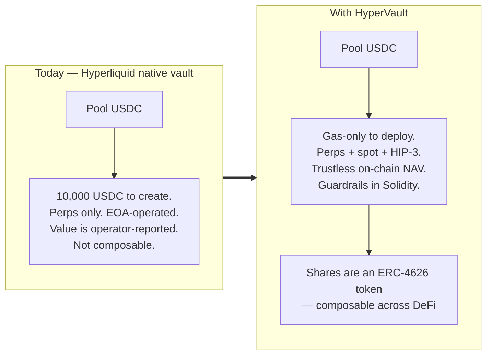
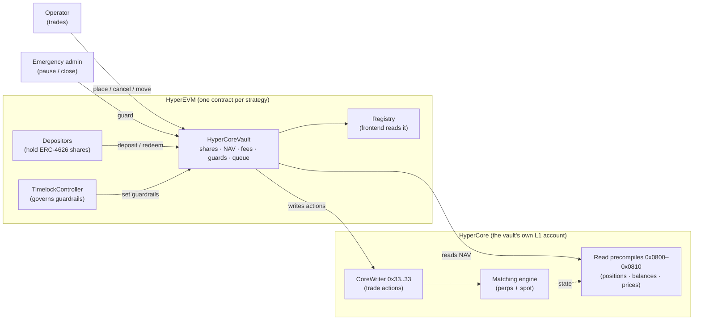
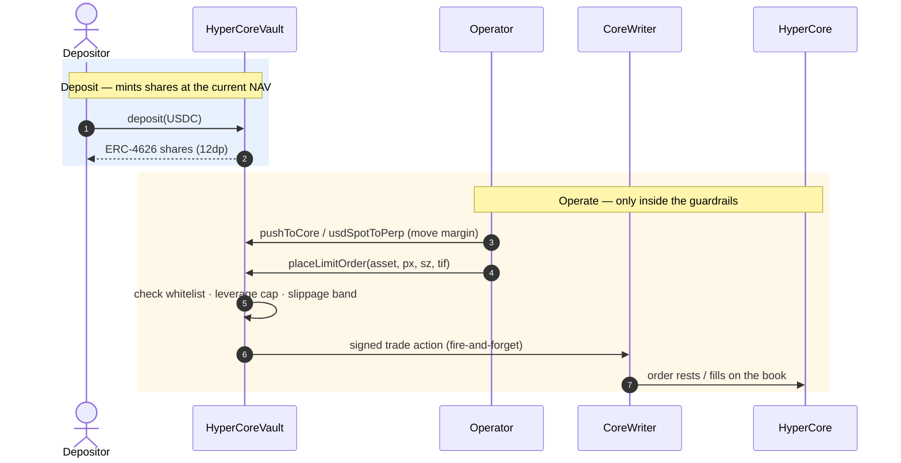
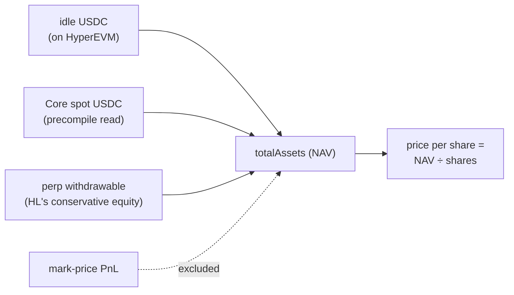
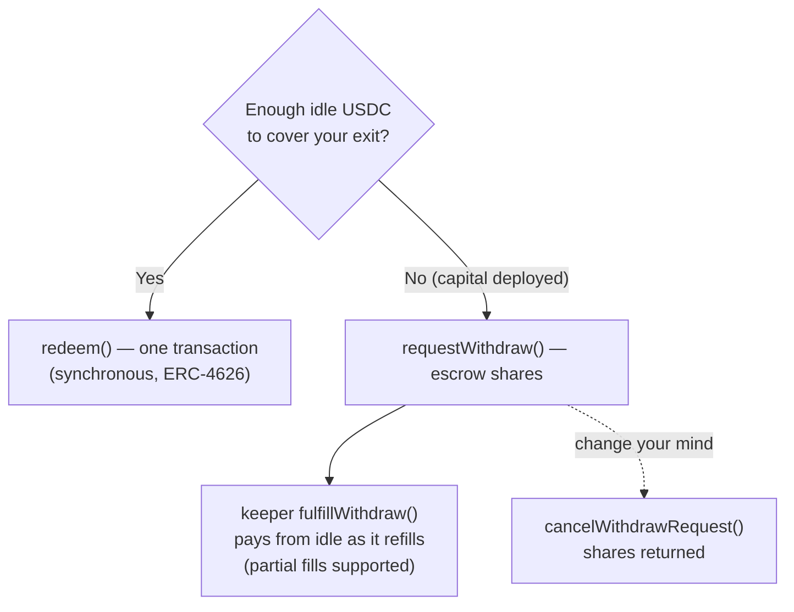
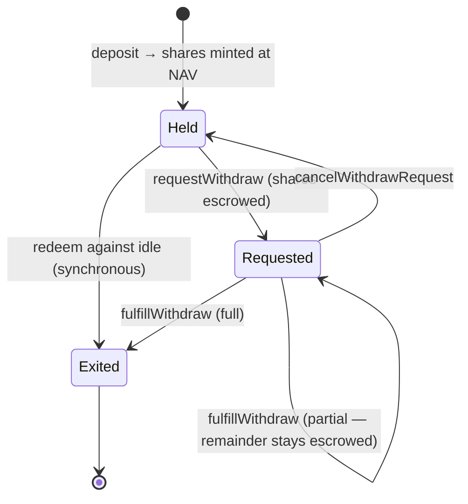
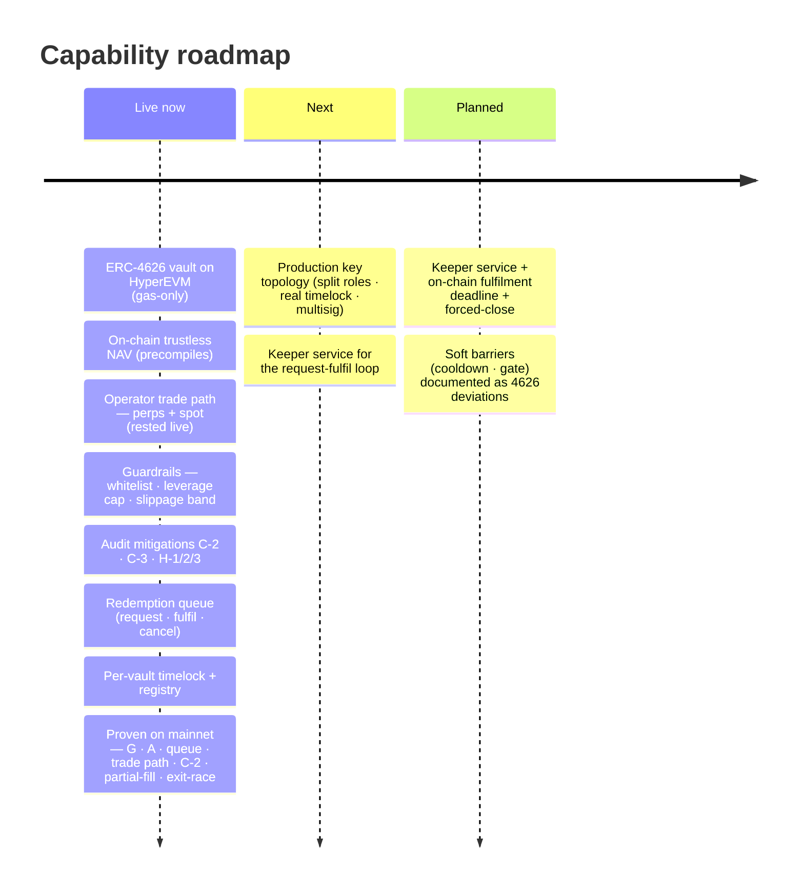

# HyperVault — Executive Overview

> **A tokenized, on-chain managed account for Hyperliquid.** Depositors hold standard ERC-4626
> shares; a permissioned operator trades the pooled USDC on HyperCore (perps + spot) from the
> vault's *own* L1 account; the value of a share is computed **trustlessly on-chain** from
> Hyperliquid's own precompiles — never reported by the operator.
>
> **Status:** audited core, plus the trade path AND the full trustless EVM/Core USDC round trip
> live-proven on **HyperEVM mainnet** (chain 999). The redemption system is the current frontier;
> its end-to-end assessment closed on live funded spikes (2026-06-03 and 2026-06-15/16). Finding G,
> the old "the vault can't move USDC to Core and back" blocker, is **resolved and proven live**. The
> residual before real LP money is operational, not a code blocker: issuer trust in Circle's bridge,
> and a production key setup. This page is the leadership-level picture; the engineering deep-dive is
> [`ARCHITECTURE.md`](ARCHITECTURE.md).

**In one sentence:** HyperVault turns a Hyperliquid trading strategy into a composable ERC-4626
token — gas-only to deploy, trading spot **and** perps from a smart-contract account, with NAV read
on-chain from HyperCore, hard-coded trade guardrails, and a liquidity-aware redemption queue — so
depositors get a transparent, self-custodied fund instead of a 10,000-USDC opaque native vault.

---

## Contents

1. [At a glance](#at-a-glance)
2. [The opportunity](#the-opportunity)
3. [Where it fits](#where-it-fits)
4. [System at a glance](#system-at-a-glance)
5. [How a deposit becomes a traded position](#how-a-deposit-becomes-a-traded-position)
6. [How NAV stays honest](#how-nav-stays-honest)
7. [How redemptions work](#how-redemptions-work)
8. [The life of a deposit](#the-life-of-a-deposit)
9. [Fees and alignment](#fees-and-alignment)
10. [Trust, security and guarantees](#trust-security-and-guarantees)
11. [Status and roadmap](#status-and-roadmap)
12. [Go deeper](#go-deeper)

---

## At a glance

| | |
|---|---|
| **What it is** | An ERC-4626 vault that runs a single Hyperliquid strategy from its own HyperCore account |
| **Who deposits** | Anyone — they receive tokenized, transferable shares (12-decimal) for their USDC |
| **Who trades** | A permissioned **operator** (a hot key/bot), inside hard-coded guardrails — they can trade, but cannot withdraw to themselves |
| **What's trustless** | **Share value (NAV)** — read on-chain from HyperCore precompiles, deliberately excluding manipulable mark-price PnL |
| **Where it runs** | One Solidity contract per strategy on **HyperEVM**; it *is* its own Hyperliquid L1 account |
| **Markets** | Perps **and** spot (incl. HIP-3 markets), via the CoreWriter system contract |
| **Cost to launch** | Gas only (~cents) — vs **10,000 USDC** for a legacy Hyperliquid native vault |
| **Maturity** | Audited core (7 critical/high mitigations baked in); trade path + redemption queue **proven on mainnet**; redemption hardening in progress |

---

## The opportunity

Hyperliquid already lets you pool capital into a **native vault** — but those are expensive
(a 10,000 USDC creation fee), **perps-only**, operated from a plain wallet (EOA), and opaque: a
depositor trusts the operator's reported value. HyperVault rebuilds that primitive as a smart
contract on HyperEVM and adds everything the native vault can't express.

The design intentionally mirrors how a real fund is governed — **separation of powers** (trade,
pause, govern are three different keys), **trust-minimized accounting** (the contract computes
value, the operator does not), and **encoded rules** (whitelists, leverage caps, slippage bands) —
but delivers it as a single token anyone can hold or integrate.

---

## Where it fits

HyperVault is a **self-custodied, on-chain managed account**: the operator can *trade* the pool but
can never *withdraw* it to an arbitrary address — the only money-out paths are LP redemptions and an
admin-allowlisted recovery destination.

| | Legacy HL native vault | Generic ERC-4626 vault | Off-chain managed fund | **HyperVault** |
|---|---|---|---|---|
| Cost to launch | 10,000 USDC | Gas | Legal + ops | **Gas** |
| Markets | Perps only | Token strategies | Anything | **HL perps + spot + HIP-3** |
| Share value (NAV) | Operator/L1 reported | On-chain (ERC-20 holdings) | Administrator NAV | **On-chain from HL precompiles** |
| Operator can abscond with funds? | Bounded by HL | Depends | Custody risk | **No** — trade-only key; dest-allowlisted recovery |
| Composable token | No | Yes | No | **Yes (ERC-4626, 12dp)** |
| Encoded guardrails | No | Varies | Off-chain mandate | **Whitelist · leverage cap · slippage band** |

The takeaway for positioning: HyperVault borrows the **composability of ERC-4626** and the
**trust-minimized NAV** of an on-chain oracle, and applies both to **active Hyperliquid trading** —
a combination neither the native vault nor a generic vault offers.

---

## System at a glance

| Component | Who runs it | Role |
|---|---|---|
| **HyperCoreVault** | The contract itself | ERC-4626 shares, on-chain NAV, fee accounting, trade guardrails, the redemption queue |
| **Operator** | The strategy team (hot key/bot) | Places and cancels orders, moves money between EVM/Core/perp — *inside* the guardrails |
| **Emergency admin** | A multisig (recommended) | Pause, cancel-all, close positions, one-way shutdown |
| **TimelockController** | Governance (recommended 24h) | The only role that can change guardrails (whitelist, caps, fees) — on a delay |
| **Registry** | Deployed once per chain | On-chain directory of vaults, so the frontend needs no indexer |
| **CoreWriter / precompiles** | Hyperliquid | The system contracts the vault writes trades to and reads NAV from |

---

## How a deposit becomes a traded position

A depositor's USDC starts idle on HyperEVM and is moved onto the vault's HyperCore account by the
operator, who then trades it. Crucially, the vault **is its own L1 account** — there is no separate
custodian.

Everything the operator can do is gated: the asset must be **whitelisted**, total perp notional must
stay under the **leverage cap**, and the price must sit within a **slippage band** of the on-chain
oracle. A compromised operator key can lose money to bad trades — but it **cannot** send the pool to
an attacker. *(Proven live: a post-only order placed from the contract rested on the real HL book.)*

---

## How NAV stays honest

The price of a share is the single most important number, so the contract computes it itself from
three on-chain reads — and **deliberately leaves out unrealized mark-price PnL**, which a thin market
can be nudged to fake for a block.

> **Why this matters.** Using Hyperliquid's own conservative `withdrawable` figure (not
> `accountValue`, which includes manipulable mark PnL) means a depositor's share price reflects
> *exitable* equity. A `strictNavReads` switch can make these reads fail-closed (revert) instead of
> reading zero, once the vault's Core account is live.

---

## How redemptions work

There are **two ways out**, and the difference is the headline of the current engineering work.
Both pay in USDC; they differ in what happens when the pool's capital is deployed on HyperCore rather
than sitting idle.

### Path A — Synchronous (instant, idle-bounded)

Standard ERC-4626 `withdraw` / `redeem`, but **capped to the idle USDC on hand**. If enough USDC is
idle, you exit in one transaction. If not, `redeem` pays what it can (a *partial fill*) and you come
back for the rest.

### Path B — The request queue (for capital that's deployed)

When the strategy's USDC is working on HyperCore, idle can be near-zero. `requestWithdraw` **escrows
your shares**; a permissionless keeper calls `fulfillWithdraw` to pay you as idle becomes available
(the operator unwinds and repatriates); `cancelWithdrawRequest` returns your shares any time.

| | Path A — synchronous | Path B — request queue |
|---|---|---|
| Transactions | 1 | 2+ (request, then keeper fulfils) |
| When it pays in full | idle ≥ your claim | as the operator repatriates capital |
| Who can fulfil | you | **anyone** (permissionless keeper) |
| Barriers | none — only the liquidity bound | none — only the liquidity bound |
| Pausable? | **redeems are never blocked**; shutdown blocks *deposits* only | same |

> **The current frontier.** This queue is deliberately **not** EIP-7540 async — it is a hardened
> sync-4626 surface plus a liquidity-gated queue. Its end-to-end behaviour (partial fills, the race
> between the two paths, fee snapshots) was just **proven on a live mainnet spike**. The hardening
> still to land: a keeper service, an on-chain fulfilment deadline, and a permissionless forced-close.

---

## The life of a deposit

Every share has a simple, fully on-chain lifecycle. Funds are never trapped *by the contract*: you
can always cancel a request to get your shares back, and redeem against idle at any time.

---

## Fees and alignment

Two fees, both designed so that **the people who stay are never diluted to pay for the people who leave**.

| Fee | How it's charged | Who pays | Alignment property |
|---|---|---|---|
| **Management** | Continuous, as a small dilutive share mint to the fee recipient | All holders, pro-rata over time | Standard AUM fee; capped at **20%/yr** |
| **Performance** | Crystallized **in USDC** out of the *exiting* LP's payout, on their own gain | Only the LP exiting, only on *their* profit | **No fee-share mint, no dilution of stayers**; per-LP cost basis, no shared high-water mark; capped at **50%** |

> The performance fee is **per-LP**: each depositor carries their own cost basis and pays a fee only
> on the gain they personally realize at exit. This is a deliberate audit mitigation (C-3) — earlier
> designs minted fee shares and diluted everyone.

---

## Trust, security and guarantees

| Guaranteed on-chain | Assumed (trust model) | Not yet |
|---|---|---|
| Share value (NAV) is computed by the contract from HL precompiles, excluding mark-price PnL | The operator trades competently (they *can* lose money on bad trades) | Production key topology — the demo collapses operator/emergency/fee into one EOA (Finding C) |
| The operator cannot move funds to an arbitrary address (recovery destinations are admin-allowlisted, C-2) | HyperCore precompiles and CoreWriter behave as documented; **Circle's USDC bridge stays live** (it's Circle-operated, upgradeable, pausable) | ~~Core→EVM repatriation (Finding G)~~, now **resolved: round trip proven live (v1.5 G2)** |
| Stayers are not diluted to pay an exiting LP's performance fee (C-3) | The operator/keeper stays available to repatriate and fulfil queued exits | Keeper automation, on-chain fulfilment deadline, permissionless forced-close (P1) |
| Redemptions are never pausable; deposits-only emergency shutdown is one-way | A multisig holds emergency powers and a real timelock governs guardrails | — |

The posture is a **self-custodied managed account**: trust is minimized on *value* and *custody*, and
explicitly placed on *trading competence* and *operator liveness* — the items on the roadmap below
progressively reduce the liveness assumption.

> **Finding G is resolved, and proven live.** We thought the shipped USDC couldn't reach Core and back,
> because the old bridge address is blacklisted on it. The live spike showed the real story: that
> "blacklist" exists because the USDC now routes through **Circle's official CoreDepositWallet** bridge,
> not the old path. So the built-in money path works once it calls the right thing: push deposits through
> Circle's wallet, and pull uses Hyperliquid's newer `send_asset` action (the old `spot_send` is silently
> ignored for these accounts, which is what the spike caught). The full loop, deposit to Core, trade,
> back to EVM, withdraw, ran end to end on mainnet. Two operational notes carry forward: there's a tiny
> withdrawal fee so you never pull the exact full Core balance, and a vault's first deposit to Core costs
> 1 USDC in one-time activation. What's left before real LP money is operational, not a code blocker:
> trusting Circle keeps the bridge live, and a production key setup.

---

## Status and roadmap

**Where we are.** The trading and accounting core is audited and proven live on HyperEVM mainnet, and
the full trustless EVM/Core USDC round trip is now proven live too (funded spikes 2026-06-03 and
2026-06-15/16). The redemption system's end-to-end assessment is complete. The next phase is the rest
of *remediation* (keeper + key topology), not assessment.

| Capability | Status |
|---|---|
| ERC-4626 vault, gas-only deploy on HyperEVM | **Live** |
| On-chain trustless NAV (excludes mark PnL) | **Live** |
| Operator trade path — perps + spot, guarded | **Live** (post-only order rested on mainnet) |
| Audit mitigations (C-2 allowlist · C-3 no-dilution · H-1/2/3 strict reads) | **Live** |
| Redemption queue — escrow · permissionless fulfil · cancel | **Live** (proven on mainnet) |
| Partial-fill + exit-race accounting (NAV > idle) | **Proven live** (2026-06-03 spike) |
| Per-vault timelock + on-chain registry | **Live** |
| Trustless EVM/Core USDC round trip (Finding G fix: wallet push + `send_asset` pull) | **Proven live** (2026-06-15/16 spike) |
| Production key topology (split roles, real delay) | **P0 — next** |
| Keeper + on-chain deadline + forced-close | **Planned (P1)** |
| Soft barriers (cooldown / gate) | **Designed (documented 4626 deviation)** |

---

## Go deeper

- **[`ARCHITECTURE.md`](ARCHITECTURE.md)** — full technical reference: contracts, NAV/fee math, the
  redemption queue, HyperCore encoding, security model, deployment, and testing.
- **[`REDEMPTION_ASSESSMENT.md`](REDEMPTION_ASSESSMENT.md)** — the end-to-end redemption review and prioritized TODOs.
- **[`FORK_PROOFS.md`](FORK_PROOFS.md)** — every finding proven on real mainnet bytecode + the live-spike results.
- **[`SECURITY.md`](SECURITY.md)** · **[`INTEGRATION.md`](INTEGRATION.md)** — security model and live-runner integration.
