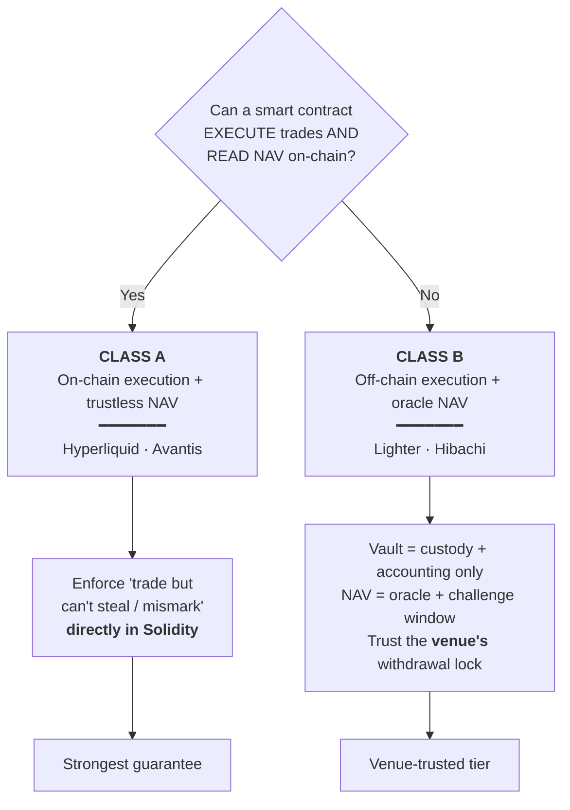
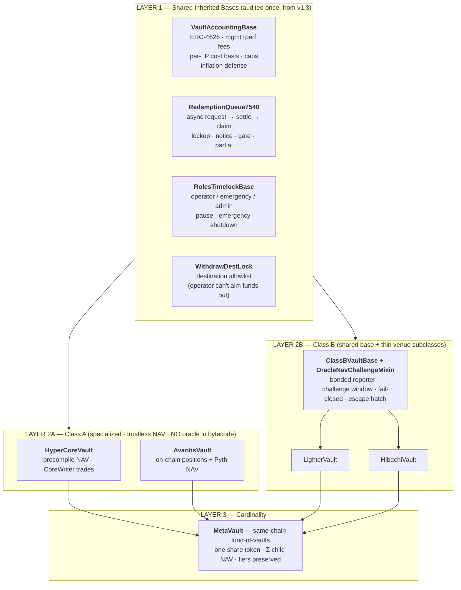
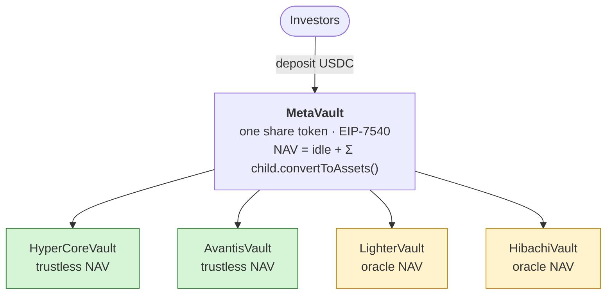
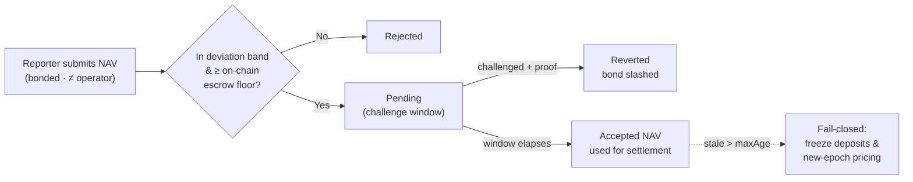
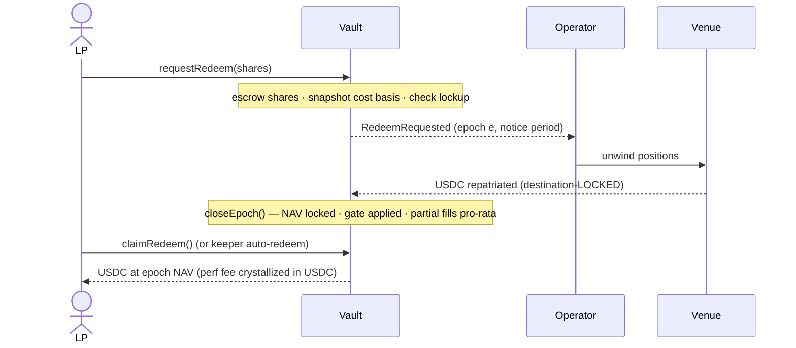
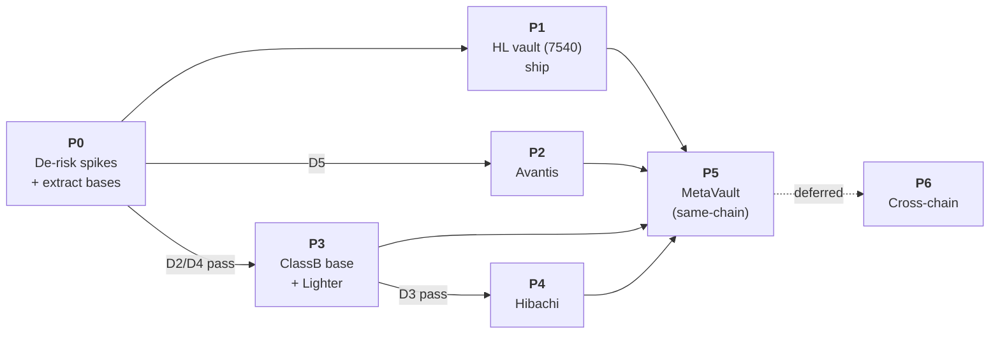

# Multi-Venue Trustless Strategy Vaults

**Architecture, Viability & Phased Proposal** — evolving **HyperVault v1.3** into an EVM- and venue-agnostic system for running quant strategies on multiple perp DEXes.

> **Status:** Draft for review · **Date:** 2026-05-29 · **Audience:** Eng + Product + Risk
> **One-liner:** Users deposit USDC → we trade it on perp DEXes → fees + enforced redemptions, with a *contract-enforced guarantee that the operator can trade but can never steal or mismark funds* — as strongly as each venue physically allows.

---

## Table of Contents

1. [TL;DR](#tldr-executive-summary)
2. [The Problem & What's Locked](#1-the-problem--whats-locked)
3. [Key Insight: Two Species of Venue](#2-key-insight-two-species-of-venue)
4. [The Crux: Why NAV Trust Decides "One vs Many"](#3-the-crux-why-nav-trust-decides-one-vault-vs-many)
5. [Recommended Architecture](#4-recommended-architecture--shared-bases-specialized-trust-paths)
6. [Cardinality: Single vs Multi-Venue](#5-cardinality-single-venue-vs-multi-venue)
7. [Trust-Critical Mechanisms](#6-trust-critical-mechanisms)
8. [Per-Venue Viability Scorecard](#7-per-venue-viability-scorecard)
9. [De-Risk Spikes — Status & Execution Plan](#8-de-risk-spikes--status--on-chain-execution-plan)
10. [Risk Register](#9-risk-register)
11. [Tiered Proposal & Phased Roadmap](#10-tiered-proposal--phased-roadmap)
12. [Decisions Needed](#11-decisions-needed--next-steps)
13. [Appendix: Standards & Prior Art](#appendix-standards--prior-art)

---

## TL;DR (Executive Summary)

> **The answer to "one universal vault or per-venue vaults?" is a hybrid — and the deciding factor is _NAV trust_, not code convenience.**

- **Venues are two different species.** On **Hyperliquid & Avantis** a smart contract can *both* place trades *and* read account value on-chain → we enforce "trade-but-can't-steal/mismark" **in Solidity** (strongest tier). On **Lighter & Hibachi** trades are signed **off-chain** and equity isn't on-chain readable → NAV must be **oracle-reported** and we lean on the *venue's* withdrawal lock (weaker, but still non-custodial tier).
- **Recommended design:** **shared inherited bases** (accounting, fees, async redemption, roles, withdrawal-lock — audited once) + **specialized Class-A vaults** that bake trustless on-chain NAV in at compile time + a **shared `ClassBVaultBase`** for the off-chain venues.
- **Why not a single generic "adapter" core?** Because a generic `totalValue()` boundary **structurally cannot prove** a Hyperliquid vault's NAV is *only* precompile-derived — it silently degrades our strongest guarantee. (Both independent design passes agreed on this.)
- **Multi-venue** (you asked us to explore it) is best done as a **same-chain fund-of-vaults**, preserving each child's trust tier. A single cross-chain share token is **deferred**.
- **🟢 Hyperliquid is production-ready** — the v1.2 "can't trade from a contract" scare was a **px/sz-scale encoding bug** (TIF off-by-one was secondary), now fixed; **D1 is CLOSED — 8/8 corrected contract orders rested live on the book.**
- **A 2026-05-29 primary-source pass** (verified L1 bytecode + official SDKs, independently grounded with on-chain `cast` reads) **strongly resolved both Class-B critical unknowns *on paper*** — and **D2 is now reproduced on a forked-mainnet harness (`6/6`), not just on paper.** Net: **Lighter is _better_ than assumed** (trustless on-chain custody — a contract is a first-class L1 owner, withdrawals are destination-bound, 14-day escape hatch ⇒ **A-custody / B-NAV**); **Hibachi is _worse_** (withdrawal destination is an arbitrary, operator-signable field ⇒ leans 🔴, fork spike pending).

| Venue | Trust Tier | Verdict |
|---|---|---|
| **Hyperliquid** | A — trustless NAV + custody | 🟢 **GREEN** — ship-ready (**D1 confirmed: 8/8 live orders rested**) |
| **Avantis** | A — trustless NAV + custody | 🟡 **YELLOW** (lock-up vs redemption SLA; role-gate trade side) |
| **Lighter** | **A-custody / B-NAV** | 🟢 custody **CONFIRMED on-chain** (fork 6/6: contract owner · dest-bound withdraw · permissionless 14d escape) · 🟡 NAV · ⏳ testnet trade-restriction |
| **Hibachi** | B — oracle NAV | 🔴 — SDK/API: arbitrary, operator-signable withdraw destination; no live operator-free escape (**spike to confirm before cut**) |

---

## 1. The Problem & What's Locked

We want on-chain vaults that:

- **Onboard capital** (USDC), deploy it into our trading strategies, **return profits**.
- Charge **management** and/or **performance** fees.
- Offer **auto-redemptions** + **enforced redemption barriers** (lockups / notice / gates).
- Guarantee funds **can't get stuck** and **leave no room for anyone to steal user funds** — trustless, or as close as the venue physically allows.
- Run on **many perp DEXes** (Hyperliquid today; Lighter, Avantis, Hibachi, …) across **multiple EVM chains**.

We already have a production-grade, **audited (v1.3)** Hyperliquid vault (`src/HyperCoreVault.sol`). We're free to refactor or replace it.

> **Decisions already locked (do not re-litigate):**
> 1. **Tiered trust** — support all venues, but tier the guarantee honestly per venue.
> 2. **Siloed per venue/chain to start** — cross-chain comes later, behind a clean seam.
> 3. **Explore both** single-venue and multi-venue cardinality.
> 4. **Code structure is flexible** — accept more complexity if it buys stronger guarantees. *"The core requirement is making this work, not finding an easy solution."*

---

## 2. Key Insight: Two Species of Venue

The architecture is dictated almost entirely by **how a smart contract can custody, trade, and value funds on each venue**. The four targets split cleanly into two classes:



| Venue | Settles on | Contract trades on-chain? | On-chain NAV? | "Can't steal" mechanism | Class |
|---|---|:---:|:---:|---|:---:|
| **Hyperliquid** | HyperCore L1 + HyperEVM | ✅ CoreWriter `0x33…33` | ✅ `withdrawable` / `spotBalance` precompiles | **Contract-enforced** — no withdraw action exists in CoreWriter | **A** |
| **Avantis** | Base L2 | ✅ typed `openTrade`/`closeTrade` | ✅ positions + Pyth read on Base | Venue-enforced for LP; we role-gate the trade side | **A** |
| **Lighter** | ZK-rollup on Ethereum | ❌ off-chain API-key orders | ❌ equity in L2 state tree | **Contract-enforced on L1** — vault is `msg.sender` owner; `withdraw` has no dest param (funds → owner only); trade-only keys sequencer-enforced | **B-NAV / A-custody** ¹ |
| **Hibachi** | Off-chain CLOB → ZK-settle Arbitrum/Base | ❌ off-chain signed orders | ❌ only at settlement | Venue-enforced — but **`withdrawAddress` is an arbitrary signed field** (SDK/API/ccxt) → operator-signable theft surface | **B** |

<sub>¹ The 2026-05-29 research revealed **custody and NAV are separable axes.** Lighter has **off-chain NAV (Class B)** but **on-chain trustless custody (Class A)** — verified L1 bytecode (now fork-confirmed) makes a contract a first-class account owner with destination-bound withdrawals. See §8.1 (D2).</sub>

> **"Trustless" is a spectrum across _two_ axes, not a binary.** Separate **custody** ("can funds only ever return to the vault?") from **NAV** ("is value on-chain-readable?"). Class A is trustless on *both*. Class B forces us to trust an off-chain key for execution and an oracle for valuation — we minimize that trust (bonds, challenge windows, escape hatches) but cannot eliminate it. **The D2 research showed Lighter splits the axes — trustless custody (A) on off-chain NAV (B)** — which is why it ranks above Hibachi. **We tier and disclose each axis.**

---

## 3. The Crux: Why NAV Trust Decides "One Vault vs Many"

We ran **two independent design passes** — one arguing for a single shared core, one arguing for specialized per-venue vaults. They **converged** on the same conclusion via one decisive fact:

> **A generic runtime adapter boundary (`adapter.totalValue()`) cannot preserve Class-A trustless NAV.**
>
> The moment a generic NAV-reporting code path exists in the codebase, an auditor can **no longer prove** that a Hyperliquid vault's NAV is *only ever* derived from the `withdrawable`/`spotBalance` precompiles — the generic (oracle-pushable) path is reachable. The strongest guarantee we have silently collapses to the weakest venue's trust model.

The corollary cuts the other way for Class B: there is **no on-chain NAV to protect** there (NAV is necessarily a reported number), so **nothing is lost by sharing code**.

**⇒ Specialize exactly the trust-critical paths (NAV + execution) for Class A; share everything else (and all of Class B).**

---

## 4. Recommended Architecture — "Shared Bases, Specialized Trust Paths"

A four-layer design. Venue-*independent* logic is shared via **inheritance** (audited once); the trust-critical NAV/execution paths are **specialized and compiled-in** per class.



### Layer-by-layer

| Layer | What | Trust property |
|---|---|---|
| **1 — Shared bases** | `VaultAccountingBase` (ERC-4626 + fee engine + per-LP cost-basis perf fee paid in USDC, no dilution of stayers + caps + inflation defense); `RedemptionQueue7540` (async epoch redemption); `RolesTimelockBase`; `WithdrawDestLock`. **Declares `totalAssets()` abstract** — the venue seam. | Venue-independent; one audit. |
| **2A — Class A vaults** | `HyperCoreVault`, `AvantisVault` inherit the bases and implement `totalAssets()` **purely from on-chain reads**. **No oracle-NAV code in their bytecode.** Typed, venue-shaped trade guards. | 🟢 Trustless NAV is a **compile-time invariant**. |
| **2B — Class B base** | `ClassBVaultBase` (+ `OracleNavChallengeMixin`): NAV = `idle + reportedEquity`, with bonded reporter, bounded deviation, challenge window, staleness fail-closed, escape-hatch true-up. `LighterVault`/`HibachiVault` are thin subclasses. | 🟡 Trust-minimized oracle. |
| **3 — Cardinality** | `MetaVault` fund-of-vaults (same-chain) over standalone child vaults. | Preserves each child's tier; ring-fences blast radius. |
| **4 — Discovery** | Registry stamps `venue`, `chainId`, `trustTier`, `version`; vaults expose `trustTier()`. Per-vault `TimelockController`. EIP-1167 factory (fixes the EIP-170 size issue). | LPs see the guarantee per vault. |

### Why this beats the pure alternatives

| Criterion | Recommended hybrid | Pure shared-core + adapters | Pure per-venue bespoke |
|---|---|---|---|
| Class-A trustless NAV preserved | **Yes** (compile-time) | **No** (generic path degrades it) | Yes |
| Code reuse / audit cost | One base audit + thin venues | One big (high-stakes) core audit | N full audits, drift risk |
| Blast radius of one venue bug | Isolated | **Systemic** | Isolated |
| Class B effort | Minimal (shared base) | Minimal | Wasteful (no guarantee to protect) |
| Matches "siloed to start" | Native | Bolted on | Native |

---

## 5. Cardinality: Single-Venue vs Multi-Venue

You asked us to **explore both**. Here they are.

### Option 1 — Single-venue per vault *(recommended default; ship first)*

One vault = one strategy on one venue, on that venue's chain. Clean NAV, clean redemption, easy to audit and reason about. Class-A vaults deliver their **full** trustless guarantee. This is the current HyperVault model.

### Option 2 — Multi-venue via a `MetaVault` fund-of-vaults *(recommended shape for multi)*



| | Fund-of-vaults *(recommended)* | Multi-venue baked into one core *(rejected)* |
|---|---|---|
| Per-venue trust tier | **Preserved** (Class-A child stays trustless) | Blended into one opaque NAV (LCD trust) |
| Blast radius | **Isolated** — quarantine a bad child | Systemic |
| Cross-chain | Shard per chain (v1 = same-chain only) | Worse — core owns cross-chain NAV trust |
| Composability | Children are standalone ERC-4626s | Only core exposed |

> **Cross-chain single share token is explicitly deferred.** Synchronously reading a child on another chain is impossible; bridging its NAV re-introduces an oracle that would drag Class-A children down to Class-B trust. v1 = one MetaVault per chain.

---

## 6. Trust-Critical Mechanisms

### 6.1 — Operator can't steal (per-venue withdrawal lock)

The linchpin of "no one can steal." For each venue: *can funds only ever return to the vault (or to depositors), never to an operator-chosen address?*

| Venue | Mechanism | Verdict |
|---|---|---|
| **Hyperliquid** | Vault **is** the Core account; **CoreWriter has no withdraw action**; `spot_send` gated to the USDC bridge or a timelocked allowlist; agent keys can't withdraw. | 🟢 **STRONG (contract-enforced)** |
| **Lighter** | Vault is the L1 owner via on-chain `addressToAccountIndex` keyed by **`msg.sender`** (no EIP-1271 needed); L1 `withdraw` has **no destination param** → funds resolve to owner only; trade-only keys sequencer-enforced. | 🟢 **STRONG (contract-enforced on L1)** — fork-confirmed 6/6 (§8.1) |
| **Hibachi** | On-chain custody, but the **withdrawal destination is an arbitrary 20-byte field inside the signed payload** (`sign(assetId‖qty‖maxFees‖withdrawAddress)`, triple-sourced); no contract-level return-to-owner lock; live escape still needs operator batch-inclusion. | 🔴 **LEAN — operator-signable to any address**; *on-chain + live-API spike D3 to confirm before cut* |
| **Avantis** | No venue withdrawal-lock — **we** role-gate so the vault is the sole `trader`/receiver. | 🟡 We enforce it — *spike D5* |

### 6.2 — Class-B oracle NAV (trust-minimized)



- **Reporter ≠ operator** (separate `NAV_REPORTER_ROLE`, bonded).
- **On-chain escrow balance** is an independent **lower-bound** cross-check.
- **Bounded per-epoch deviation** caps how fast a compromised reporter can move NAV.
- **Propose → challenge window → accept**: anyone can challenge with a venue-signed snapshot / ZK proof / DA blob; bad marks slash the bond.
- **Fail-closed** on stale/missing data — never blocks the already-claimable queue or the escape hatch.
- **Hardening ladder:** prefer an on-chain-verifiable **venue-signed or ZK balance attestation** (*spike D4*) → drops residual trust from "bonded reporter" to "attestation-checked."

### 6.3 — No stuck funds / redemption / escape hatches (EIP-7540)



| Stuck-funds mode | Mitigation |
|---|---|
| Operator vanishes, capital on venue | Per-venue **escape hatch**: HL `emergencyClosePositions`→`pullFromCore`; Lighter **L1 14-day priority-tx → permissionless Desert Mode** (contract-callable, fork-confirmed); Hibachi **operator-free escape is _planned, not live_** (today needs operator batch-inclusion); Avantis role-gated `closeTrade`. Permissionless forced-close after a missed `fulfillmentDeadline`. |
| NAV oracle stale → redemptions freeze | Fail-closed blocks *new* pricing only; claimable queue + escape hatch proceed at last-good NAV. |
| Donation to empty vault | Seed deposit + `operatorSweepStranded` when `totalSupply==0` (already in v1.3). |
| Avantis lock-up vs redemption SLA | Longer redemption epoch for the Avantis sleeve + idle buffer; disclose early-exit fee. |
| Emergency role bricks redemptions | Invariant preserved: **`redeem` is never blocked, even when paused**. |

### 6.3.1 — Current (v1.3) redemption model vs proposed

> The shipped vault is **synchronous ERC-4626 with a liquidity-gated bespoke queue.** The EIP-7540 epoch machine and the lockup/notice/gate barriers above are **net-new (proposed)** — they are **not** in `src/HyperCoreVault.sol` today.

| | Current (v1.3 · `src/HyperCoreVault.sol`) | Proposed (`RedemptionQueue7540`) |
|---|---|---|
| Standard | **Synchronous OZ `ERC4626`** — no EIP-7540 | ERC-4626 **+ EIP-7540** request/settle/claim (hand-rolled; OZ ships none) |
| Sync exit | `withdraw`/`redeem` **capped to idle EVM USDC** (`maxWithdraw = min(owned, idle)`; `redeem` partial-fills) | Request-based; priced at epoch NAV |
| Overflow exit | Bespoke `requestWithdraw` → escrow shares at vault → `fulfillWithdraw(lp)` (**permissionless/keeper**, partial fills, one open request per LP, cancelable) | Epoch queue: request → `closeEpoch()` NAV lock → claim |
| Barriers | **None** — no lockup, notice, gate, cooldown, or epoch; only the *liquidity* bound | **Enforced** lockup · notice · gate · partial, per sleeve |
| Auto-redeem | Off-chain keeper may call `fulfillWithdraw`; **no on-chain SLA/deadline** | Keeper auto-redeem + permissionless forced-close after a missed `fulfillmentDeadline` |
| Pause behavior | Redeems **never** pausable; emergency shutdown blocks deposits only | Same invariant preserved |

So today's "barrier" is purely a **liquidity bound** (you can pull what's idle; the rest waits for the operator to repatriate from Core, then a keeper clears the escrow queue). The enforced policy barriers are part of the P1 EIP-7540 work, not the audited v1.3.

---

## 7. Per-Venue Viability Scorecard

| Venue | Class | NAV integrity | Fund safety ("can't steal") | Redemption | **Verdict** |
|---|:---:|---|---|---|:---:|
| **Hyperliquid** | A | 🟢 Trustless (precompiles, no setter) | 🟢 Strong (no withdraw action) | 🟢 Trustless pricing + escape hatch | 🟢 **GREEN** |
| **Avantis** | A | 🟢 Trustless (positions + Pyth on Base) | 🟢 Very strong (only exit = `closeTrade`→vault) | 🟡 Near-sync + lock-up caveat | 🟡 **YELLOW** |
| **Lighter** | B-NAV / **A-cust** | 🟡 Oracle + challenge window | 🟢 **Strong (contract is L1 owner; dest-bound withdraw)** — ✅ fork-confirmed 6/6 | 🟢 Queue + permissionless 14d Desert escape (contract-callable) — ✅ fork-confirmed | 🟢 (NAV-pending) |
| **Hibachi** | B | 🟡 Oracle (no per-acct on-chain getter) | 🔴 **Arbitrary, operator-signable `withdrawAddress`** (SDK/API/ccxt) | 🟡→🔴 Operator-batch-dependent today; operator-free escape *planned, not live* | 🔴 |

<details>
<summary><b>Hyperliquid — detail</b></summary>

- Vault **is** the HyperCore account; funds custodied at the contract address.
- The 15 CoreWriter actions contain **no bridge-out/withdraw** action; `spot_send` is gated to the USDC bridge (`pullFromCore`) or a timelocked allowlist (`operatorRecoverSpot` / `spotRecoverDest`).
- **The v1.2 "contract can't place orders" finding was a self-inflicted `px`/`sz`-scale bug** (orders encoded at the wrong decimal scale read as sub-cent dust below the $10 min and were silently dropped; the TIF off-by-one — `tif=0` out of range, HyperCore uses `1=ALO, 2=GTC, 3=IOC` — was a *secondary* contributor). Both fixed in v1.3. ✅ **D1 now CLOSED — 8/8 corrected contract orders rested live on the book.**
- NAV excludes mark-price PnL by design (uses conservative `withdrawable`).
</details>

<details>
<summary><b>Avantis — detail</b></summary>

- Base L2; `avUSDC` is an ERC-4626 counterparty vault; trades priced by **Pyth with a dual-oracle 5% deviation cancel guard**.
- `openTrade`/`closeTrade` are **two-step** (request → keeper executes at oracle price, charges an ETH execution fee). NAV must count **pending-order collateral** so mid-flight share pricing isn't gameable.
- Positions readable on-chain (`get_trades(trader)` via a Multicall aggregator) → genuinely Class A.
- **14d–6mo soft lock-up** with a 10%→0% early-exit fee — must be reflected in the Avantis sleeve's redemption SLA.
</details>

<details>
<summary><b>Lighter — detail</b></summary>

- App-specific ZK-rollup on **Ethereum mainnet**; verified `ZkLighter` proxy `0x3B4D…5ca7` → impl `0xc4F388…009C` (+ `AdditionalZkLighter` `0x22F0…668f`) holds assets + the canonical state root; **per-account equity is reconstructed off-chain** from DA blobs (not L1-readable) → NAV stays Class B.
- ✅ **D2 fork-confirmed:** ownership is the on-chain mapping `addressToAccountIndex`, gated by **`msg.sender`** — **a smart contract is a first-class owner; no EIP-1271 needed** (the ECDSA path is an off-chain convenience only). The L1 `withdraw` carries **no destination argument** → funds resolve to the owner's address only. ⇒ custody is **Class A (trustless)**.
- **Escape hatch (contract-callable):** 14-day priority-tx queue → permissionless `activateDesertMode()` → `performDesert` proves balances against the frozen state root if the sequencer censors.
- 🟡 **Residual (needs live confirmation):** the "operator can trade but not withdraw" restriction is **sequencer-enforced off-chain** (maker-only keys / Public Pools) — confirm on `testnet.zklighter.elliot.ai` (chain 300); plus **Stage-0 instant upgradeability** of the proxy. See §8.1.
</details>

<details>
<summary><b>Hibachi — detail</b></summary>

- Off-chain CLOB; encrypted order data → Celestia; **Succinct (SP1) ZK proof posted on-chain** gates collateral movement; Arbitrum + Base; collateral USDT/USDC (Arb), USDC (Base). Settlement proxy `0x0080…9977` → impl `0x6c1d…d223` (upgradeable; admin `0x20ccbd…`).
- **Myth corrected:** there is **no separate destination-locking "withdrawal key."** The *same* signing key authorizes trades *and* withdrawals (the only split is API-key-for-auth vs signing-key); for **exchange-managed accounts the operator's HMAC secret signs withdrawals**.
- 🔴 **D3 leans RED on paper (triple-sourced — SDK + Postman + ccxt):** the withdrawal **destination is an arbitrary 20-byte field inside the signed payload** — whoever holds the signing material can withdraw to any address. **No contract-level return-to-owner lock.** Deposits are plain ERC-20 sweeps to an **EOA** (no on-chain owner mapping); contract / **ERC-1271 wallets appear unsupported** (Safe explicitly unsupported; RFC-6979 ECDSA required).
- **Escape hatch:** the operator-free, Celestia-native recovery is **planned, not live**; today a withdrawal still needs operator batch-inclusion. The on-chain SP1 proof attests per-account *correctness* but exposes **no per-account balance getter** → NAV cannot be upgraded to proof-checked today (*spike D4*). See §8.2.
</details>

---

## 8. De-Risk Spikes — Status & On-Chain Execution Plan

> **Updated 2026-05-29** after a primary-source research pass (official docs, **verified L1 bytecode**, official SDK/API repos — `lighter-go`/`lighter-python`, Hibachi `hibachi_sdk`/Postman/ccxt) that was **independently grounded on-chain** with `cast` reads of the live mainnet contracts.
>
> **Standing rule (do not relax):** the research **strongly resolves both critical unknowns *on paper* — D2 favorably, D3 unfavorably — but no result is accepted until it is reproduced on a forked-mainnet harness running the venue's *real deployed bytecode*, or against a *live testnet/API*.** Doc/SDK reads set the **hypothesis**; the spike is the **proof**. (This is the px/sz-scale lesson: an answer that looked sufficient on paper still has to rest on the book.) D2's on-chain layer is now executed and green; D3's is pending.

### 8.0 — Spike status board

| Spike | Question | Paper verdict (research) | On-chain status | Verdict gate |
|---|---|---|---|---|
| **D1** | HL contract order rests on the book? | — | ✅ **CONFIRMED on mainnet — 8/8 corrected orders rested** | 🟢 **CLOSED** |
| **D2** | Lighter: contract can own + trade-not-steal + escape? | 🟢 Strongly **YES** (verified bytecode) | ✅ **Fork: 6/6 PASS on real mainnet bytecode** · ⏳ testnet trade-restriction pending | 🟢 **custody CONFIRMED on-chain** |
| **D3** | Hibachi: withdrawal dest bindable to the vault? | 🔴 Strongly **NO** (SDK/API/ccxt triple-sourced) | ⏳ Fork + live-API spike pending | 🔴 cut if confirmed |
| **D4** | Class-B NAV attestation on-chain-verifiable? | 🟡 Partial (Lighter: blob/desert proof; Hibachi: no per-acct getter) | ⏳ pending | sets NAV trust floor |
| **D5** | Avantis trader semantics + lock-up | — | ⏳ Base-fork pending | sleeve SLA |
| **D6** | Cross-chain in-transit accounting *(only if multi-chain later)* | — | deferred | design-time |

### 8.0.1 — Verification substrate — independently confirmed live (`cast`, 2026-05-29)

Both fork targets are **real, verified, deployed bytecode holding live funds** — exactly what we fork (not a mock). Addresses + code sizes below were read directly from public RPCs this session.

| Venue | Layer | Contract | Address | On-chain check |
|---|---|---|---|---|
| **Lighter** | ETH mainnet (1) | ZkLighter (proxy) | `0x3B4D794a66304F130a4Db8F2551B0070dfCf5ca7` | 1,367 B · impl slot → `0xc4F388…009C` ✅ |
| Lighter | ETH mainnet | ZkLighter impl | `0xc4F38883af6d07D826A20A581cB21fFc2a58009C` | 24,462 B ✅ |
| Lighter | ETH mainnet | AdditionalZkLighter | `0x22F05515497ce8D78f3898088C474403Ac9C668f` | 24,523 B ✅ |
| Lighter | off-chain seq | testnet API · signing chain **300** | `testnet.zklighter.elliot.ai` | trade-restriction layer |
| **Hibachi** | Arbitrum One (42161) | Settlement (proxy) | `0x00804a9d1c033109d17aa4bf5a45f12211419977` | 1,159 B · impl slot → `0x6c1d…d223` ✅ |
| Hibachi | Arbitrum One | Settlement impl | `0x6c1d6fed03b74c942f64c7f0c4be691ba324d223` | 23,022 B ✅ |
| Hibachi | Arbitrum One | Proxy admin (upgrade authority) | `0x20ccbd11422e233785f313dfb5b21ba5033dee50` | upgrade-risk surface |
| Hibachi | off-chain prover | live REST API | `api.hibachi.xyz` / `api-staging.hibachi.xyz` | dest-arbitrariness end-to-end |

> **No public chain testnet** was found for either Lighter's L1 or Hibachi (only off-chain API testnets). ⇒ the **forked-mainnet** harness is the substrate for every *on-chain* guarantee; off-chain sequencer/prover behavior runs against the live testnet/API.

```mermaid
flowchart LR
    subgraph ON["On-chain layer — FORKABLE (real mainnet bytecode)"]
        F1["Lighter · ETH-mainnet fork<br/>ZkLighter 0x3B4D…5ca7<br/>own · withdraw · desert-mode"]
        F2["Hibachi · Arbitrum fork<br/>Settlement 0x0080…9977 → impl 0x6c1d…d223<br/>claim-dest · forced-exit"]
    end
    subgraph OFF["Off-chain layer — NOT forkable (live testnet/API)"]
        O1["Lighter testnet (chain 300)<br/>maker-only key can't withdraw?"]
        O2["Hibachi live API<br/>withdrawAddress ≠ owner accepted?"]
    end
    F1 --> V1{"D2 verdict"}
    O1 --> V1
    F2 --> V2{"D3 verdict"}
    O2 --> V2
    V1 -->|"all green"| G1["A-custody / B-NAV"]
    V2 -->|"no dest lock"| G2["defer Hibachi"]
    classDef a fill:#d6f5d6,stroke:#2e7d32; classDef b fill:#ffd6d6,stroke:#c62828;
    class G1 a; class G2 b;
```

### 8.1 — D2 · Lighter (custody fork-CONFIRMED; testnet trade-restriction remains)

**Hypothesis (from verified L1 bytecode — `ZkLighter` impl `0xc4F388…009C` + `AdditionalZkLighter`):** a vault contract is a **first-class L1 owner** — ownership is the on-chain mapping `addressToAccountIndex`, authenticated by **`msg.sender`** (no EIP-1271 needed; the ECDSA path is an off-chain convenience only); the L1 `withdraw` has **no destination parameter** (funds resolve only to the owner's registered address); and a **14-day priority-tx queue + permissionless Desert-Mode** (`activateDesertMode` → `performDesert`) lets the contract exit without the operator. ⇒ Lighter is **A-custody / B-NAV** — a tier *above* the original "weak Class B" assumption.

**Layer 1 — On-chain (forked Ethereum mainnet, REAL ZkLighter bytecode).** `test/fork/LighterCustody.fork.t.sol`, `vm.createSelectFork($ETH_MAINNET_RPC)`. A `LighterVaultProbe` contract plays the vault:

| # | Action against the real ZkLighter proxy | On-chain pass criterion | Proves |
|---|---|---|---|
| 1 | `deal` USDC → probe; `probe.deposit(to=probe, assetIdx=3,…)` | `addressToAccountIndex(probe) != 0`; `Deposit`/`NewPriorityRequest` event | a contract can own an account |
| 2 | `probe.changePubKey(idx, apiKeyIdx, schnorrPk)` | priority request enqueued, `msg.sender`-gated | contract installs an L2 trade key |
| 3 | **non-owner** EOA calls `withdraw(probeAcctIdx,…)` | **reverts** `AccountIsNotRegistered` | only the owner can move funds |
| 4 | `probe.withdraw(probeAcctIdx, 3,…)` then `withdrawPendingBalance(probe)` | payout resolves to `owner` only (no dest arg exists) | withdrawals are **dest-bound to the vault** |
| 5 | `vm.warp(+14d)`; **unrelated** addr calls `activateDesertMode()` | `desertMode == true` | permissionless freeze |
| 6 | `performDesert` access-control + payout | credits/transfers only to the owner acct | escape hatch lands at the vault |

All criteria are storage reads / events / reverts on real bytecode — **no mocks, no `CoreSimulator`-style stubs.**

> **EXECUTED 2026-05-29 — `test/fork/LighterCustody.fork.t.sol`, forked Ethereum mainnet (real ZkLighter bytecode), `6/6 PASS` (1.4s).**
> - **D2.1** a plain probe contract deposited 100 USDC and **synchronously became account index `727173`** (`addressToAccountIndex` 0 → nonzero, `= lastAccountIndex+1`). **A contract IS a first-class L1 owner — no EIP-1271.**
> - **D2.2** the contract installed an L2 trading key (`changePubKey` enqueued a priority request).
> - **D2.3** a non-owner EOA calling `withdraw` for the probe's account **reverted `AccountIsNotRegistered`**.
> - **D2.4** the owner's `withdraw` enqueued — the ABI carries **no destination argument** (payout can only reach the owner).
> - **D2.5** after `warp(+14d)`, an **unrelated address** called `activateDesertMode()` and froze the rollup — **permissionless escape confirmed**.
> - **D2.6** `performDesert` reverts without a valid ZK proof (un-forgeable); `withdrawPendingBalance` is owner-keyed; `getPendingBalance(owner)==0`. *(USDC verified = `0xA0b8…eB48`; min deposit 1 USDC.)*
>
> ⇒ **D2 on-chain custody layer CONFIRMED on real bytecode.** The earlier "verified bytecode" reading is now reproduced in execution, satisfying the no-mock rule. **Still open:** Layer 2 (off-chain operator-trade-restriction on testnet) + the Stage-0 upgradeability trust assumption.

**Layer 2 — Live testnet (off-chain sequencer — NOT forkable).** `testnet.zklighter.elliot.ai`, signing chain **300**. Confirm the one property that lives *off-chain*: **the operator's trade key cannot withdraw.**
- Install a **maker-only** key (`set_maker_only_api_keys`, idx ≥ 4) and/or run capital inside a **Public Pool** (whitepaper §3.1: sub-accounts/pools "cannot withdraw, can trade").
- Sign an L2 `Withdraw` with the restricted key → **expect sequencer rejection**; sign an order → expect acceptance. Confirm `MintShares`/`BurnShares` are the only capital in/out of a pool.

**Design corollary baked into `LighterVault`:** the **vault contract keeps the L1 forced-withdraw / Desert-Mode monopoly**, so even a misbehaving sequencer can't trap funds — the operator only ever holds a maker-only/pool key.

**Prereqs:** archive/full **ETH-mainnet RPC** (fork — ran against a public node, archive preferred for speed); a funded **Lighter testnet account** + Schnorr keypair (`lighter-python`, chain 300).
**Decision gate:** Layer-1 all-green (done) ⇒ custody = Class A (trustless). Layer-2 confirms operator-trade-only ⇒ Lighter **promoted to 🟢 custody / 🟡 NAV**; proceed to P3 with NAV floor set by D4.
**Residual trust:** Stage-0 **instant upgradeability** — proxy governance can swap the impl with no exit window (inspect on the fork; price as a standing assumption, not code-eliminable on our side).

### 8.2 — D3 · Hibachi (leans RED; confirm on fork + live API *before* cutting)

**Hypothesis (from official SDK + Postman API + ccxt fork, triple-sourced):** the withdrawal destination is an **arbitrary 20-byte field inside the signed payload** — `sign(assetId‖quantity‖maxFees‖withdrawAddress)` — with **no contract-level return-to-owner lock**. Deposits are plain ERC-20 sweeps to an **EOA** (no on-chain owner mapping). Contract/ERC-1271 wallets appear **unsupported** (Safe explicitly unsupported; RFC-6979 ECDSA required). The only operator-free escape is **planned (Celestia-native), not live.** ⇒ Hibachi **fails the destination-bound "can't steal" bar** as it stands. *D3 must still be executed on-chain to confirm/debunk before we cut the venue.*

**Layer 1 — On-chain (forked Arbitrum One, REAL settlement bytecode).** `test/fork/HibachiCustody.fork.t.sol`, fork proxy `0x00804a9d…` → impl `0x6c1d6fed03b74c942f64c7f0c4be691ba324d223` (23 KB, resolved this session via the EIP-1967 slot).
- **Resolve & read the implementation ABI** (Arbiscan verified source / Sourcify / 4byte; else selector-decompile). Enumerate the withdraw/claim/forced-exit surface. *Question it answers:* does the **live bytecode** contain **any** destination-constraint or **timeout-gated, operator-independent forced-withdraw**?
- **Claim-destination probe:** drive the contract into a claimable-withdrawal state and call the claim path with `dest = vault` vs `dest = attacker`. *Pass-for-safety* = contract pins payout to the bound owner; *Fail (expected)* = honors the signed arbitrary address. (Caveat: a genuine claim needs a valid SP1 proof we cannot forge → we test the entrypoint's **access-control + destination handling** via storage injection / prover-role impersonation, and document exactly what the *bytecode* enforces vs what only the *off-chain prover* gates.)
- **Forced-exit probe:** call any forced/escape selector with no prior operator batch → expect revert / requires-proof ⇒ confirms the escape is **operator-dependent** today.
- **Upgrade-risk note:** admin `0x20ccbd…` can swap the 23 KB impl with no exit window — record as a standing trust assumption.

**Layer 2 — Live API (off-chain prover — NOT forkable).** Funded test account (~10 USDT min) on `api-staging.hibachi.xyz` / `api.hibachi.xyz`:
- Submit `/capital/withdraw` with `withdrawAddress ≠ owner` → **observe whether the operator accepts** (the SDK proves the field is *free*; the live call proves it is *honored end-to-end*) — the empirical theft-surface confirmation.
- Attempt account creation/binding from a **contract / ERC-1271 wallet** → confirm supported or not (docs say Safe unsupported).

**Prereqs:** **Arbitrum-One archive RPC** (fork); **Arbiscan API key** (verified source/ABI); a funded Hibachi account (no chain testnet ⇒ small real USDT vs staging/mainnet API).
**Decision gate:** if Layer-1 shows **no destination lock + no operator-free forced-withdraw** AND Layer-2 confirms arbitrary-dest acceptance ⇒ **D3 = RED → defer Hibachi** until (a) destination-binding ships, (b) the Celestia-native escape goes live, and (c) ERC-1271 binding is supported. If — contrary to the lean — the impl pins payout to a bound owner ⇒ re-tier to 🟡 and proceed to P4.

### 8.3 — Secondary spikes (run alongside)

- **D4 — Class-B NAV attestation.** *Lighter:* equity is reconstructable from L1 DA blobs and provable via the Desert/`performDesert` circuit → a **periodic ZK balance attestation** is the NAV-trust ceiling (verify the verifier on the fork). *Hibachi:* **no per-account on-chain getter** → NAV stays oracle-reported (no on-chain upgrade path today). Sets each venue's NAV trust floor.
- **D5 — Avantis trader semantics.** Base fork: confirm `openTrade`/`closeTrade` two-step returns collateral + PnL to the **vault-as-trader**; quantify the 14d–6mo lock-up + early-exit fee against the sleeve redemption SLA.
- **D6 — Cross-chain in-transit accounting** *(only if pursuing multi-chain later)*. Explicit in-transit USDC bucket across chains.

---

## 9. Risk Register

| # | Risk | Severity | Mitigation | De-risk first? |
|---|---|:---:|---|:---:|
| R1 | ~~HL live contract order never confirmed resting~~ → **CLOSED** (D1: 8/8 corrected orders rested on mainnet) | ~~High~~ → ✅ Resolved | Spike D1 done; off-chain place≠fill reconciliation remains (R11) | ✅ Done |
| R2 | ~~Lighter L1 owner must be EOA (no EIP-1271)~~ → **resolved in bytecode + fork**: contract owns via `msg.sender`. Residual = operator-trade-restriction is *off-chain* (sequencer) | 🔴→🟢 (residual 🟡) | D2 fork proved on-chain custody (6/6); testnet to prove maker-only/pool can't withdraw; vault keeps L1 forced-withdraw monopoly | ✅ |
| R3 | Hibachi withdrawal destination arbitrary + operator-signable | 🔴 Critical (**substantiated** — SDK/API/ccxt) | D3 fork + live-API to confirm; if confirmed → **defer Hibachi** until dest-binding + operator-free escape + ERC-1271 ship | ✅ |
| R4 | Class-B NAV mismark within challenge band | 🔴 Critical | Bonded reporter + permissionless challenge + bounded deviation + fail-closed; prefer attestation | ✅ |
| R5 | Multi-venue NAV contamination (weakest-link) | High | One-venue-per-vault default; fund-of-vaults for multi; per-sleeve fail-closed | ✅ |
| R6 | Avantis lock-up vs redemption SLA | High | Longer Avantis-sleeve epoch + idle buffer; disclose fee | Product |
| R7 | Operator vanishes with capital on venue | High | Per-venue escape hatch + permissionless forced-close after deadline | In v1 of each venue |
| R8 | Avantis trade-side theft via wrong receiver/role | High | Role-gate close/withdraw; vault is sole trader/receiver | Design-time |
| R9 | Cross-chain in-transit float mis-accounted | Med | Explicit "in-transit" NAV bucket | Design-time |
| R10 | Stale-oracle deadlock freezing redemptions | Med | Time-boxed last-good fallback; never gate escape hatch on oracle | Design-time |
| R11 | CoreWriter fire-and-forget: place ≠ fill | Med | Off-chain reconciliation (already documented) | Operational |
| R12 | HL leverage cap is best-effort (splittable orders) | Low/Med | Documented; pair with off-chain monitoring | Operational |

---

## 10. Tiered Proposal & Phased Roadmap



| Phase | Deliverable | Gate |
|---|---|---|
| **P0** | De-risk spikes D1–D5 + extract Layer-1 bases at behavioral parity; re-green audit suite | Spike results decide Class-B set |
| **P1** | Re-parent `HyperCoreVault` onto bases + EIP-7540 redemption → hardened single-venue HL vault | Behavioral parity vs v1.3 audit tests |
| **P2** | `AvantisVault` (2nd Class A, trustless Pyth NAV, role-gated trade side) — Base fork tests | Needs D5 |
| **P3** | `ClassBVaultBase` (NAV axis) + `OracleNavChallengeMixin` + `LighterVault` — but `LighterVault` uses the **trustless A-custody** path (contract owner + L1 forced-withdraw), only its **NAV** is Class B | D2 custody **fork-confirmed**; gate = testnet trade-restriction + D4 NAV floor |
| **P4** | `HibachiVault` (thin Class B; per-chain collateral) | **D3 leans 🔴 — likely DEFERRED** pending dest-binding + operator-free escape + ERC-1271 |
| **P5** | `MetaVault` (same-chain fund-of-vaults; multi-epoch redemption routing) | Multi-venue cardinality |
| **P6** | Cross-chain (deferred, gated on a trust-minimized NAV bridge) | Out of scope until justified |

<sub>Critical path to a hardened, EIP-7540, single-venue HL vault: **P0 → P1**. Each additional venue is an isolated, parallelizable task once the bases + `ClassBVaultBase` are frozen. Audit: one heavy engagement (bases + HL) + a lighter pass per venue thereafter.</sub>

---

## 11. Decisions Needed / Next Steps

1. **Approve the de-risk-first sequencing** (P0 spikes before any Class-B build). ← biggest ask.
2. **Continue the spike execution.** The Lighter Layer-1 fork harness is **built and green** (`test/fork/LighterCustody.fork.t.sol`, 6/6). Remaining: the **Hibachi Arbitrum fork** (`test/fork/HibachiCustody.fork.t.sol`) + the two live-account spikes — Lighter testnet (chain 300) and the Hibachi API. Prereqs: an **Arbitrum-One archive RPC** + **Arbiscan API key** (Hibachi fork), a **Lighter testnet account** + Schnorr keypair, and a **small-USDT Hibachi account**.
3. **Confirm re-sequenced venue priority.** Research shifts the suggested order to **Avantis → Lighter → (Hibachi deferred)**: Lighter's custody is now **fork-confirmed** (A-custody), while Hibachi leans 🔴 pending spike — likely parked, not next.
4. **Sign off on the tiering policy** being surfaced on-chain — now **two axes** (`custodyTier()` + `navTier()`, or a combined `trustTier()` that encodes both) + registry, disclosed to LPs. Lighter is the motivating case (A-custody / B-NAV).
5. **Greenlight the v1.3 → bases refactor** (P0/P1) — behavior-preserving, re-uses the audited code.
6. **Confirm cross-chain is deferred** (single cross-chain share token explicitly out of v1 scope).

---

## Appendix: Standards & Prior Art

**Standards we build on:**
- **EIP-4626** — tokenized vault interface (the base).
- **EIP-7540** — async deposit/redeem (request → settle → claim); the home for "enforced redemption barriers." *(OZ v5.1.0 ships no implementation — hand-rolled.)*
- **EIP-5143** — slippage-protected vault entry/exit. **EIP-7575** — multi-asset / multiple entry points (relevant only for a future cross-chain hub).

**Prior art that validates the pattern** (shared core + constrained execution boundary):
- **Enzyme** — IntegrationManager adapters + PolicyManager hooks (whitelisted targets + selectors).
- **dHEDGE / Toros** — transaction/asset "guards" (manager trades, can't redirect withdrawals).
- **Morpho Vaults V2** — adapters + curator/validator split + timelocks.
- **Lagoon** — Safe + guard module + async EIP-7540 + separate valuation/curator roles.
- **Gains gToken / GMX GLP** — epoch-gated redemption (passive counterparty contrast).

> **Net:** our hybrid borrows the *constrained-execution + role-separation + timelock* spine these protocols proved out, and adds the **Class-A specialization** they don't need (they trade on-chain DeFi where value is always readable) but we do (to preserve trustless perp NAV on Hyperliquid/Avantis).

---

<sub>Sources: repo `docs/{ARCHITECTURE,SECURITY,INTEGRATION}.md` + `src/` (Hyperliquid facts); Hyperliquid, Avantis developer docs; EIPs 4626/7540/7575/5143; Enzyme / dHEDGE / Morpho / Lagoon repos & docs.</sub>
<sub>**D2 (Lighter) primary sources (2026-05-29):** verified L1 source via Etherscan/Sourcify (`ZkLighter` impl `0xc4F388…009C`, `AdditionalZkLighter`, `Storage.sol`, `Config.sol`); whitepaper (`assets.lighter.xyz/whitepaper.pdf`); L2BEAT Lighter page; SDKs `github.com/elliottech/{lighter-go,lighter-python}` (signing/withdraw/changePubKey code); reproduced on-chain by `test/fork/LighterCustody.fork.t.sol` (forked mainnet, 6/6). **D3 (Hibachi) primary sources (2026-05-29):** `github.com/hibachi-xyz/{hibachi_sdk,ccxt}` (withdraw-signing code), Postman API spec `api-doc.hibachi.xyz` (`/capital/withdraw`), docs `docs.hibachi.xyz` (key-management, verification, signing-up), Succinct + Celestia blogs. **Independently grounded on-chain (`cast`, 2026-05-29):** code-sizes + EIP-1967 impl/admin slots of every address in §8.0.1 read live from public RPCs (ETH mainnet, Arbitrum One).</sub>
